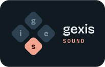

  

# Gexis Player

**Your music lives in many places: Spotify, a server in the cupboard, Plex,
the phone in your pocket. Gexis Player brings all of it to one place: a
Raspberry Pi 4 with a good DAC and a touchscreen, next to your amplifier.**

An audiophile streamer for the Raspberry Pi and the DIY audio community.
Bit-perfect up to 24-bit / 192 kHz, every source on one screen, set up from
your phone in minutes. Free and open source: no ads, no account, no
subscription.

  

  
  

  
  

  
  

Shown with a public-domain demo library. 
📸 <a href="docs/SCREENSHOTS.md"><b>See every screenshot</b></a>: the panel, the bar and the phone.

> 🧪 **Testing releases are out.** Gexis Player is built in the open, plays
> every day on its reference devices, and updates itself over the network:
> a new release never needs a reflash. The first Stable release is next.

Gexis began as the player for one living room and grew into something we are
genuinely proud of. It is built on many years of other people's open-source
work, so it goes back out the same way: free, under the GPL, with every line
in the open. If it makes your music sound and look a little better, it has
done its job, and we are glad to share it.

---

## 🎵 What it does

### 🎧 Plays from the apps you already use

It appears as a speaker in the Spotify app, as a player in Lyrion and
Plexamp, and as a Bluetooth speaker on your phone. Start playing from any of
them and Gexis hands over: the source that was playing is stopped politely,
a short transition shows who is taking over, and the new one plays. Nothing
to disconnect first, no juggling apps when two of them want the DAC: the
newest deliberate choice wins, and the others are told.

### 🎚️ Sounds the way the file does

Bit-perfect to the DAC up to 24/192. The volume is set in the DAC's own
hardware, in software for an output with none of its own (HDMI), or fixed for
an amplifier that does it. A maximum level holds for every source, and
Spotify never starts louder than you allow. Because Gexis is the whole
system, not an app on someone else's, the audio chain can be checked rather
than taken on trust.

### 🖼️ Shows every track the same way

Artwork, synced lyrics, artist biographies and photos, and the album the track
is from, whether it came from Spotify, your own files, Plex or a phone. When
nothing is playing: a clock, the weather and wallpapers. When you just want to
watch the music: up to 287 visualiser skins, from studio VU meters and a
spectrum from 50 Hz to 16 kHz to turntables and tape decks whose records and
reels turn as the music plays.

### 📲 Sets up from your phone, and stays set up

On first boot the player opens its own Wi-Fi, the panel shows two QR codes,
and your phone walks you through the rest: your Wi-Fi, a name, the time, the
output, your music and the screen. The screen and the DAC are recognised where
they can be, so most answers are already filled in. After that, updates arrive
over the network, every setting is on your phone as well as the panel, your
phone doubles as a touchpad for the screen, and a backup brings it all back on
a new card, during setup, straight from your phone. No keyboard, no terminal,
no config files.

## 📚 Your library, with Lyrion

Gexis plays your own music through **Lyrion Music Server**, the free,
open-source server that grew out of Logitech Media Server and SlimServer and
has been refined by its community for two decades. Gexis does not reinvent a
library; it uses one of the most mature there is:

- **Built for big collections.** Lyrion indexes tens of thousands of files on
  a NAS, a USB drive or a share, and keeps them browsable by album, artist,
  genre, year and playlist.
- **More than your files.** Lyrion's own apps add internet radio, podcasts and
  streaming services, all playing through the same player.
- **Played and browsed on the panel.** Albums, artists, playlists and radio
  from the touchscreen, with the queue beside Now Playing, and every Lyrion
  app on your phone or computer still at hand.
- **Wherever it suits you.** Use the Lyrion server you already run, or switch
  on the Lyrion Server plugin and the player keeps your library itself; its
  scans run at the lowest priority, and a full scan of a large library played
  through 40 minutes without a gap. Or leave Lyrion out: Spotify, Plexamp and
  Bluetooth work without it.

## 🔌 Plugins: make it yours

Gexis is built to be extended. A plugin adds a **source** that plays through
the player or a **service** that runs beside it, and is switched on, updated
or removed from Settings, with its progress shown in the switch itself.

- **Ready today:** Plexamp, the Lyrion Server, the visualiser skin packs, and
  Beszel monitoring with its connection shown in Settings.
- **Your own:** upload a plugin from Settings on your phone. It speaks a small
  JSON protocol over a local socket, so it can be written in any language, and
  runs in a sandbox the player sets up for it. The
  [plugin guide](docs/WRITING-A-PLUGIN.md) takes you from an empty folder to a
  plugin installed from your phone, with two working examples.
- **Clean to remove:** Remove deletes what a plugin downloaded, and a plugin
  that fails says why on its own row.

## ✨ Features at a glance

| | |
|---|---|
| 🔊 **Sources** | Spotify Connect · Lyrion (squeezelite) · Bluetooth (A2DP) · Plexamp · your own plugins |
| 🎚️ **Sound** | Bit-perfect up to 24/192 · hardware, software or fixed volume · a maximum level for every source · a starting volume Spotify never exceeds |
| 🔀 **Handover** | One source at a time, never mixed · takeover in any direction · the previous source released before the next one plays |
| 🖼️ **Now playing** | Artwork · synced or plain lyrics · artist information and photos · the Lyrion queue |
| 📈 **Visualiser** | Up to 287 skins, depending on the screen · VU meters, spectrum, turntables and tape decks · progress, time, volume and play-state in each skin's own style · skins that rotate per track |
| 🖥️ **Screens** | HDMI touchscreens from 7" to 13.3", including 7.9" and 11.9" bar displays, recognised and laid out for their shape · or Headless, with no screen at all |
| 🧭 **Setup** | Over the player's own Wi-Fi (WPA2, password on the panel) or your network on a cable · a wrong password brings setup back with the reason · a player that starts without its Wi-Fi offers setup again after 90 seconds |
| 💾 **Backup & restore** | Settings, pairings and source logins in one archive, on a network share or downloaded to your phone · restored during setup, which asks for this player's output and screen and lets you change the rest · one player's backup can start a second one, leaving the first one's sign-ins behind |
| ⬆️ **Updates** | Over the network, with release notes · *Testing* gets each release first, *Stable* once it has been tried |
| 🔗 **Network** | Wi-Fi or cable, and the cable wins while it is plugged in · a fixed address on either, kept only once it is shown to work |
| 📱 **Settings anywhere** | The full settings on the panel and on any phone or computer on your network, with a mini player on the phone |
| 🖐️ **Phone as a touchpad** | Drive the panel from across the room: one finger moves a pointer, a tap presses, two fingers scroll, a pinch zooms, and a text field on the panel brings up the phone's keyboard · no app to install |
| 🩺 **When something is wrong** | A problem report in one download, with addresses, names, keys and what you play taken out first · hardware feedback that tests your screen's touch and your DAC's rates |

## ⚖️ Limitations and trade-offs

We'd rather you knew these up front:

- **Tested hardware is narrow.** A Raspberry Pi 4 (4 GB); the HiFiBerry
  DAC2 HD and IQaudIO Pi-DAC PRO; four HDMI touch screens. Other DACs and
  screens are listed but untested - see the
  [hardware requirements](docs/HARDWARE.md).
- **On a phone you get Settings and a mini player, not the whole player.**
  The mini player has the volume, a touchpad and buttons that drive the panel;
  the library is browsed on the panel, in a Lyrion app or in your streaming
  app.
- **Plexamp keeps its own volume.** This comes from Plexamp itself: it
  scales the sound inside its own engine and does not hand its level to the
  player. So the Plexamp app's slider sets Plexamp's level, the panel's sets
  the DAC's, and the two are separate numbers. Every other source shares the
  panel's one volume.
- **Not a store product.** It's a hobby project: one guy with a love for
  hi-fi and a clear idea of how a player should work, building it carefully
  with the help of AI and testing it on real hardware. There is no support
  team behind it.

## 📖 Documentation

- **[User manual](docs/manual/README.md)**: the screen, the phone page and
  every setting, with screenshots.
- **[FAQ](docs/FAQ.md)**: questions and answers, from setting up to sound,
  network and updates.
- **[Hardware requirements](docs/HARDWARE.md)**: minimum and recommended,
  and what each rests on.
- **[Technical guide](docs/tech/00-overview.md)**: how the player is built
  and how it works inside, with diagrams.
- **[Writing a plugin](docs/WRITING-A-PLUGIN.md)** and the
  **[plugin contract](docs/PLUGIN-CONTRACT.md)**: for adding a source or a
  service of your own.

## 🗺️ Roadmap

Rough, and subject to change:

- ✅ **Done:** first boot without a network, set up from your phone over the
  player's own Wi-Fi, with the screen and the DAC recognised. Restoring a
  backup during setup. Updates over the network, on a Testing and a Stable
  channel. Touchscreens from 7" to 13.3", bar displays included. Plugins that
  download software, with progress, retry and remove, and your own plugins
  installed from Settings. A mini player on the phone. Animated skins with
  scrolling tickers and smooth rotation. A fixed address on cable or Wi-Fi.
  Problem reports and hardware feedback.
- 🔜 **Next:** the first Stable release.
- 🎨 **Later:** themes. Artist and album information from your own Plex server.
- 💭 **Maybe:** a visual equaliser, room correction with a phone as the
  microphone, the DAC's own filter and polarity options.

## 📜 Legal

**Gexis Player is free software under the GNU General Public License, version 3
or later.** It is provided **as is, without any warranty**, without even the
implied warranty of merchantability or fitness for a particular purpose. You
use it at your own risk, including any risk to your equipment and your hearing.

It is built on the work of many open-source projects, each under its own
licence. The full list, with licences and authors, is in
[THIRD-PARTY.md](THIRD-PARTY.md) and on the device under Settings → System →
Legal and Credits.

**Some software is not part of Gexis Player** and is downloaded on your device
from its maker only when you switch it on. It is used under its maker's terms:

- **Plexamp** is Plex, Inc.'s proprietary software.

Spotify Connect is provided through go-librespot, an independent open-source
client that ships in the image. It is not made or endorsed by Spotify.

**Gexis Player is not affiliated with, endorsed or sponsored by** Spotify,
Plex, Lyrion, the Bluetooth SIG, Raspberry Pi or HiFiBerry. Their names
and logos are trademarks of their owners and are used only to name what works
with what.

## 🙏 Credits

Gexis Player stands on the shoulders of PeppyMeter and its skin artists,
squeezelite, go-librespot, bluez-alsa, Lyrion, Raspberry Pi OS and many more,
all listed in [THIRD-PARTY.md](THIRD-PARTY.md). None of this would exist if
they had not shared their work first. Thank you.

Found a bug, tried it on a DAC or screen nobody has yet, or written a plugin?
Issues and feedback are very welcome - *Settings → System → Hardware
feedback* on the player fills most of a report in for you.
