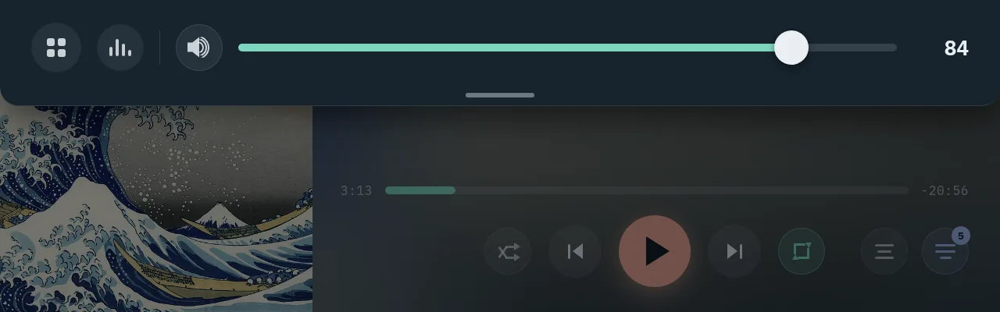
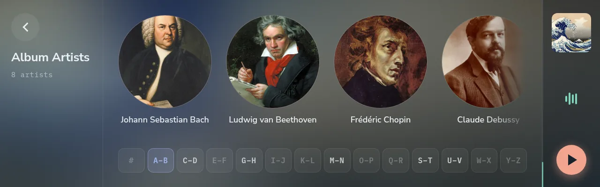
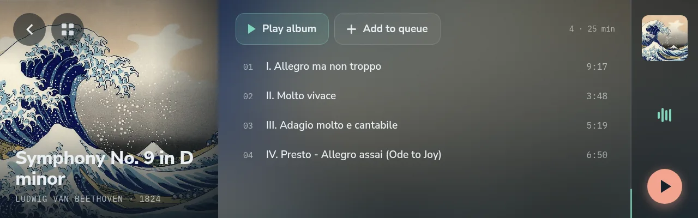
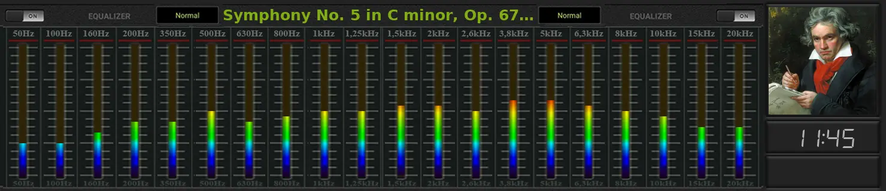
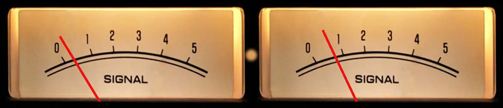

# Screenshots

Every screenshot in the [user manual](manual/README.md), in one place, taken
with a public-domain demo library.

## The 10.1" panel (1280 × 800)

<table>
<tr>
<td align="center" valign="top"> Home</td>
<td align="center" valign="top"> Now Playing</td>
</tr>
<tr>
<td align="center" valign="top"> Lyrics, synced to the song</td>
<td align="center" valign="top"> The artist, beside the track</td>
</tr>
<tr>
<td align="center" valign="top"> The release</td>
<td align="center" valign="top"> The queue</td>
</tr>
<tr>
<td align="center" valign="top"> Volume</td>
<td align="center" valign="top"> My Music</td>
</tr>
<tr>
<td align="center" valign="top"> Browse</td>
<td align="center" valign="top"> Album Artists</td>
</tr>
<tr>
<td align="center" valign="top"> An artist page</td>
<td align="center" valign="top"> An album page</td>
</tr>
<tr>
<td align="center" valign="top"> Playlists</td>
<td align="center" valign="top"> A playlist</td>
</tr>
<tr>
<td align="center" valign="top"> Radio</td>
<td align="center" valign="top"> Settings</td>
</tr>
</table>

## The 11.9" bar (shown at 1280 × 400)

<table>
<tr>
<td align="center" valign="top"> Now Playing</td>
<td align="center" valign="top"> Home</td>
</tr>
<tr>
<td align="center" valign="top"> The tray</td>
<td align="center" valign="top"> Album Artists</td>
</tr>
<tr>
<td align="center" valign="top"> An artist</td>
<td align="center" valign="top"> An album</td>
</tr>
</table>

## The visualiser, moving

Two of the skins, on the 10.1" panel and on the 11.9" bar.

<table>
<tr><td align="center" valign="top"> VU meters over a spectrum</td>
<td align="center" valign="top"> Artwork with a small spectrum</td></tr>
<tr><td align="center" valign="top" colspan="2"> Spectrum on the bar</td></tr>
<tr><td align="center" valign="top" colspan="2"> Meters on the bar</td></tr>
</table>

## On a phone

Settings and the mini player, in the phone's browser. No app to install.

<table>
<tr>
<td align="center" valign="top"> Settings</td>
<td align="center" valign="top"> The touchpad and mini player</td>
<td align="center" valign="top"> Display settings</td>
</tr>
</table>

Back to the [overview](../README.md).
