# Gexis Player — User Manual

**Draft, written for 0.9.2.** The screenshots use a demonstration library of
public-domain works: the album covers are paintings by Hokusai, Van Gogh,
Klimt, Kandinsky, Monet, Seurat, Marc, Rousseau, Hiroshige, Mucha, Gauguin
and others, the portraits are of the composers, and the lyrics are
Schiller's *Ode to Joy* (1785). The addresses shown are examples.

Gexis Player is a music player for the Raspberry Pi 4 with a high-quality
DAC. It plays your Lyrion (Logitech Media Server) library, Spotify Connect,
Bluetooth and Plexamp, and switches between them by itself. You control it
from its own touch screen (the *panel*), from any phone or computer on the
same network (the *phone page*), or from the apps you already use: a
Lyrion app, Spotify, or your phone's Bluetooth.

## Contents

1. [The panel at a glance](#1-the-panel-at-a-glance)
2. [Now Playing](#2-now-playing)
3. [The library](#3-the-library)
4. [Lyrion's own menus (Extended navigation)](#4-lyrions-own-menus-extended-navigation)
5. [When another source takes over](#5-when-another-source-takes-over)
6. [The idle screen and the visualiser](#6-the-idle-screen-and-the-visualiser)
7. [The phone page](#7-the-phone-page)
8. [Bar screens](#8-bar-screens)
9. [Settings](#9-settings)
10. [Updates](#10-updates)

---

## 1. The panel at a glance

The panel shows one of two places at a time:

- **Now Playing**: the track, its cover and the controls, whenever something
  plays.
- **The library**: your music, starting at **Home**.

The **mini strip** along the bottom of the library always shows what is
playing; tap it to go back to Now Playing. On Now Playing, the **Home**
button (bottom left) opens the library at Home, and the **Minimise**
chevron (top left) goes back to exactly where you were in the library.

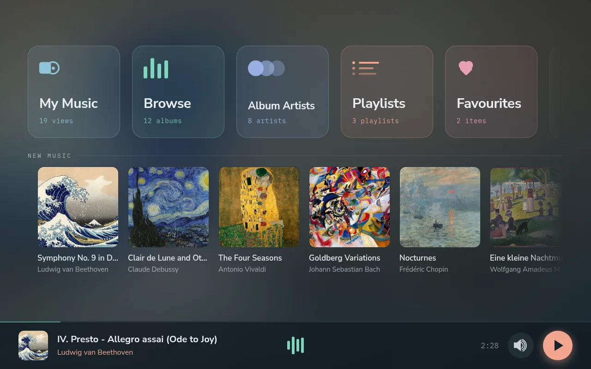

*Home: the cards along the top, the newest albums underneath, and the mini
strip at the bottom. The row of cards scrolls sideways.*

Everything on the panel works by touch: tap to open, swipe to scroll. Lists
with many entries have a **letter rail** down the right-hand side; tap a
letter to jump there.

## 2. Now Playing

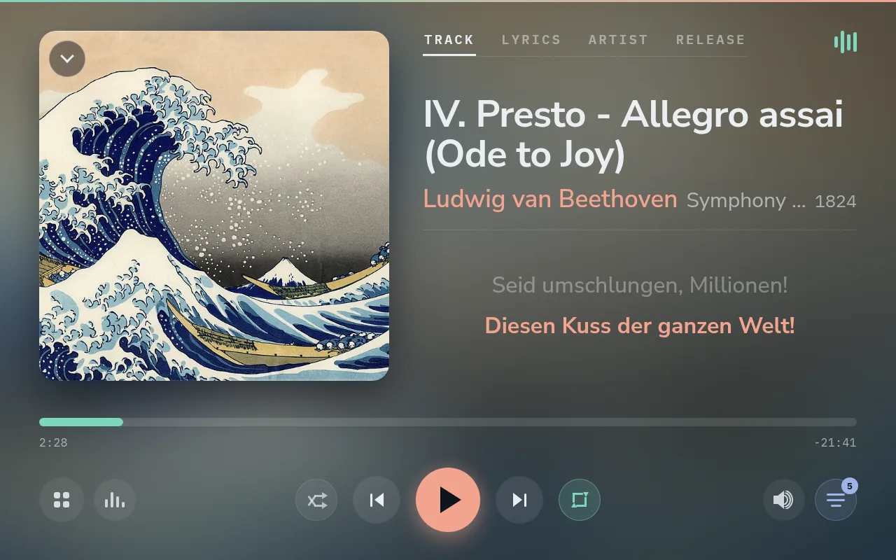

| Part | What it does |
| --- | --- |
| Cover | The album's art. With none from the source, the player looks one up. |
| Chevron (top left) | Minimise: back to the library where you left it. |
| Tabs | **Track**, **Lyrics**, **Artist**, **Release** (below). |
| Visualiser button (top right) | Shows the visualiser (section 6). |
| Progress bar | Elapsed and remaining time; tap to move through the track where the source allows it. |
| Home (bottom left) | The library, at Home. |
| Shuffle, previous, play/pause, next, repeat | As offered by the source playing. A source that cannot do something has that button greyed out. |
| Volume (bottom right) | Opens the volume drawer. |
| Queue (bottom right) | Lyrion's queue, with the number of tracks still to come. |

**Track** shows the title, artist, album and year, and, when the song has
synchronised lyrics, the current line and the next one. Tap the artist's
name to open their page in the library.

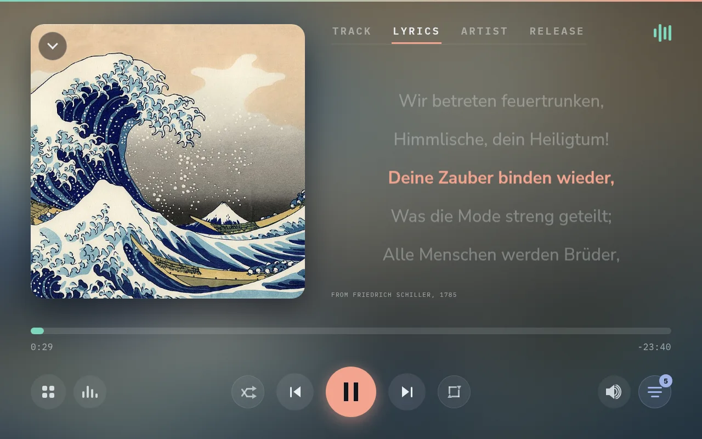

**Lyrics** shows the whole text, following the music when the lyrics are
synchronised.

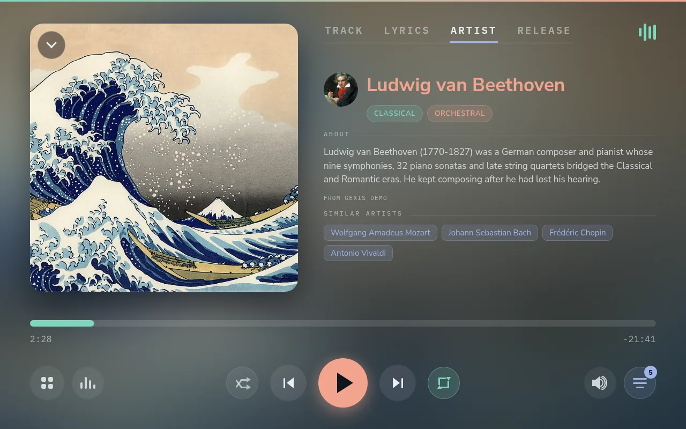

**Artist** shows a short biography, the artist's genres and similar artists.

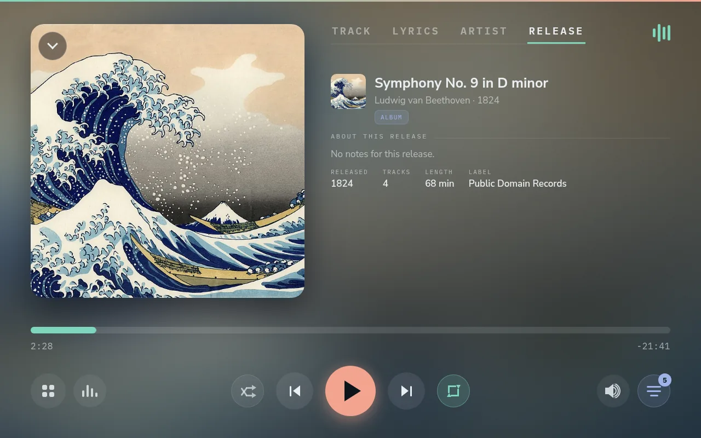

**Release** shows the album's year, number of tracks, length and label,
with a note about the release when one is available.

### The queue

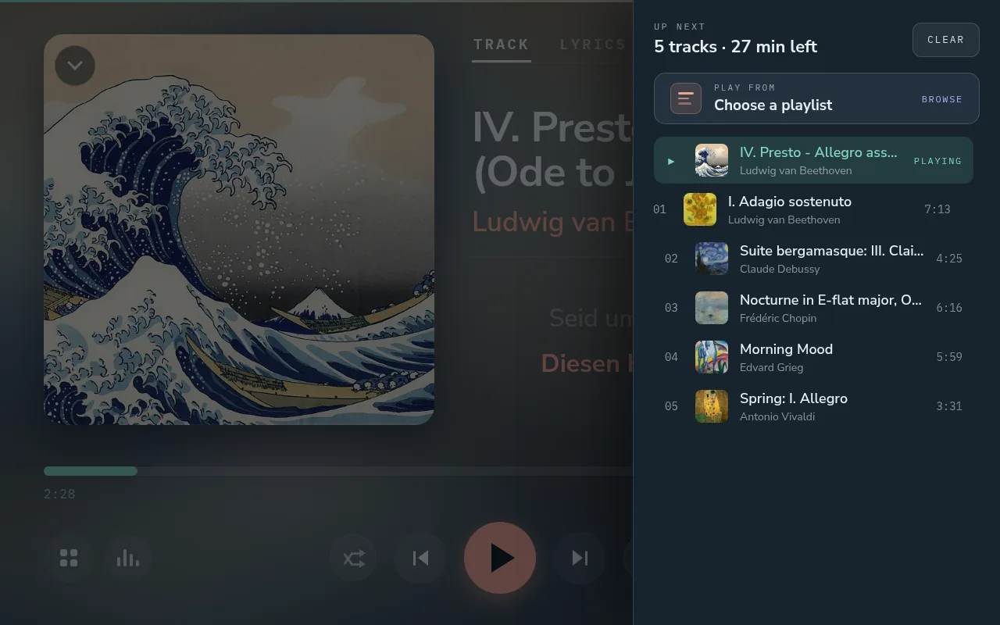

The queue lists what Lyrion will play next, with the time left. Tap a track
to play it; **Clear** empties the queue; **Play from** starts a playlist.

### The volume drawer

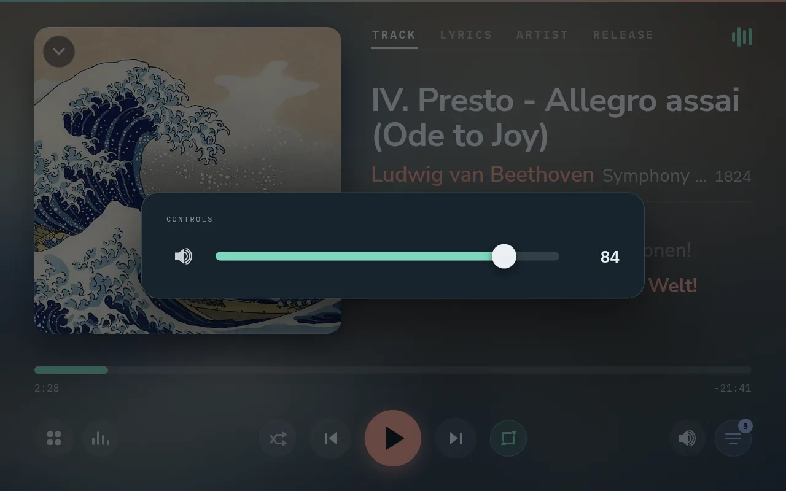

Drag the slider or tap along it. The drawer closes by itself after a few
seconds, but stays open while the phone's pointer rests on it. A change made
elsewhere (a phone, a Lyrion app) can open the drawer too
(*Settings → Display → Show volume when changed elsewhere*).

With **Output mode** set to *Fixed*, the player always plays at full level
for an amplifier that sets the volume; the button then shows a padlock and
the drawer explains why.

## 3. The library

The library is your Lyrion server's music. Home offers:

| Card | Opens |
| --- | --- |
| My Music | Lyrion's own library views (only with Extended navigation, section 4). |
| Browse | Three columns: artist, album, tracks. |
| Album Artists | Every album artist, with their portrait. |
| Playlists | Your Lyrion playlists. |
| Favourites | Your Lyrion favourites (Extended navigation). |
| New Music | The newest albums (also the row under the cards). |
| Radio | Lyrion's radio directory. |
| Apps | Lyrion's apps, such as streaming services (Extended navigation). |
| Settings | The player's settings (section 9). |

### Browse

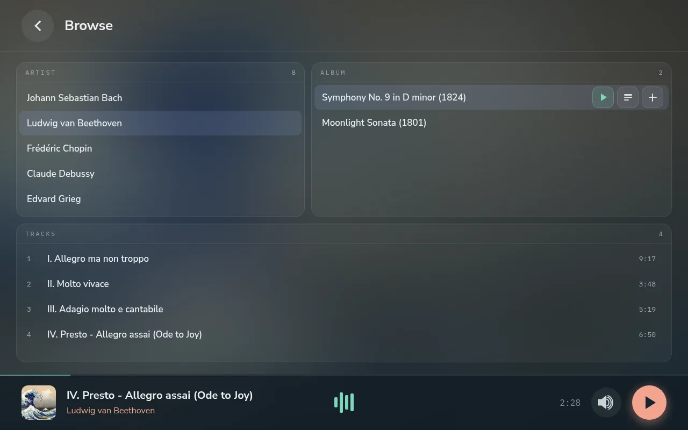

Pick an artist, then an album, then a track. A tap on a row shows its
actions:

- **Play** plays it now;
- **Add to queue** adds it to the end;
- **+** adds it to a playlist.

### Album Artists and the artist page

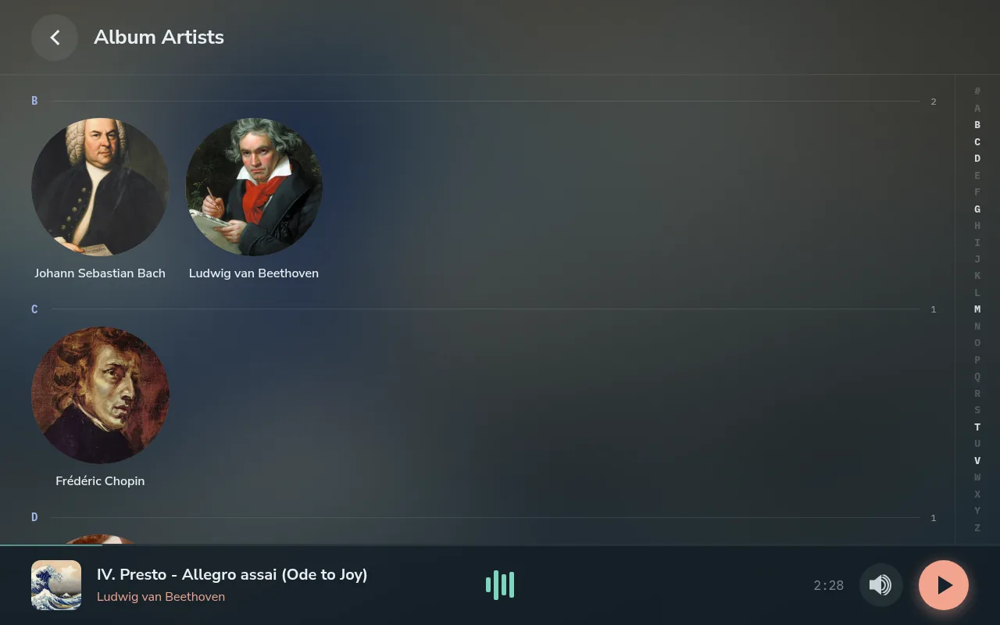

Artists are grouped by letter; tap a letter on the rail to jump.

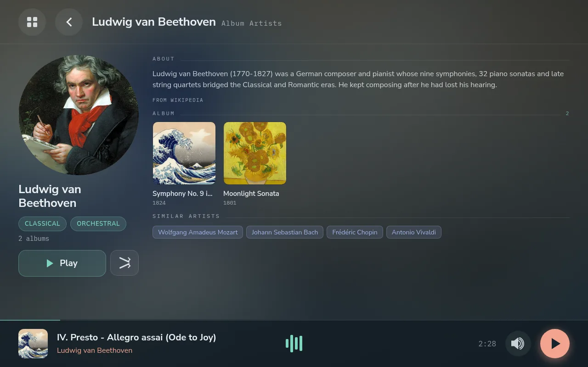

An artist's page shows their portrait, genres and albums. It also has
**Play** and **Shuffle** for everything by them, a biography and similar
artists.

### Album page

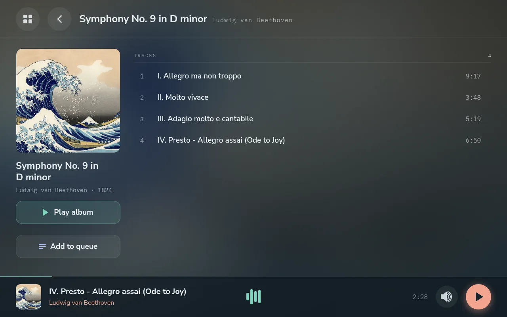

**Play album** or **Add to queue**, and the tracks with their lengths. Tap a
track once to show its actions, twice to play it.

### Playlists

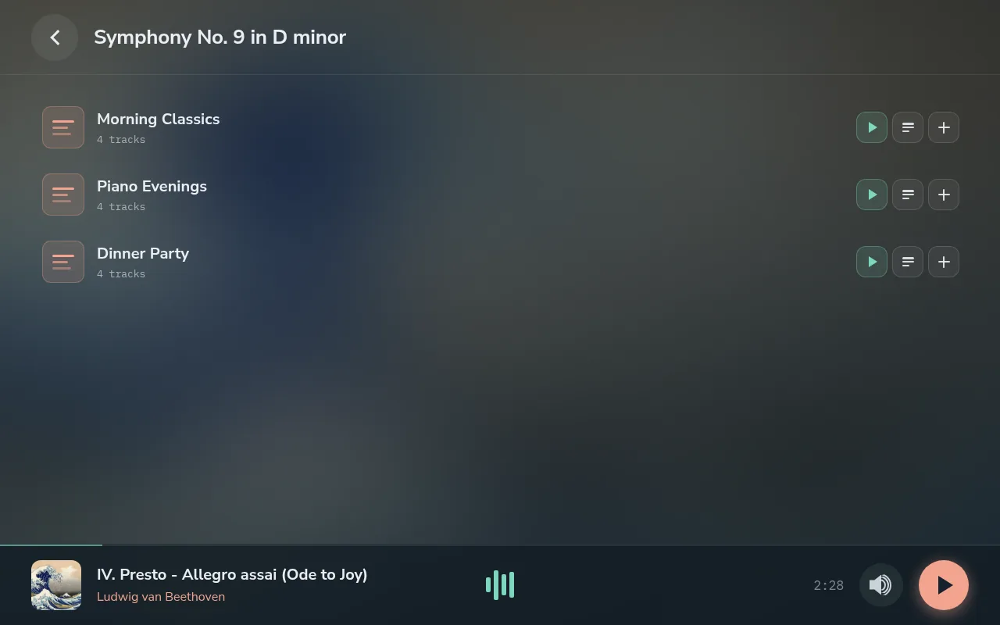

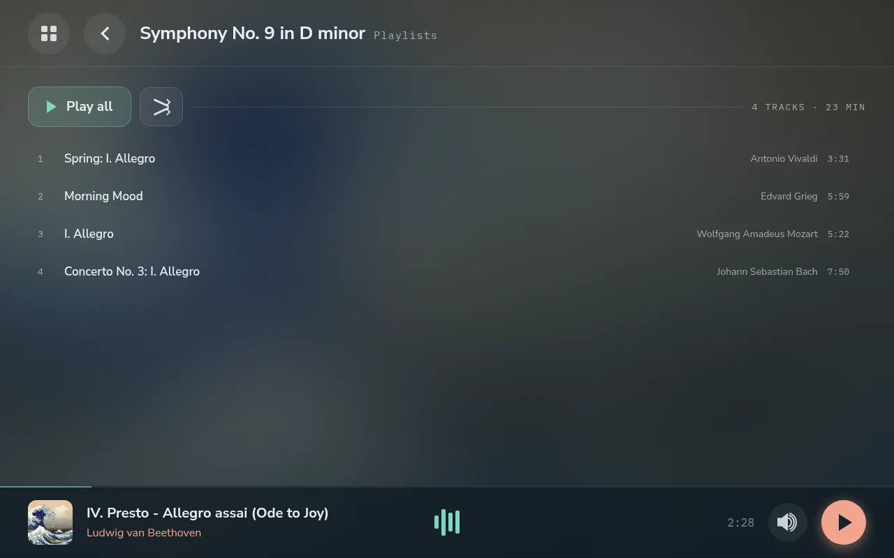

### Radio

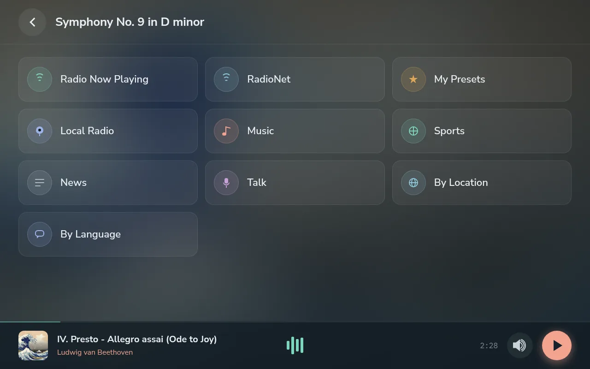

Lyrion's radio directory, by category. Tap a station once to show **Play**
and **Add**, twice to play it.

## 4. Lyrion's own menus (Extended navigation)

Switch on **Settings → Sources → Lyrion Client → Extended navigation** and
Home gains **My Music**, **Favourites** and **Apps**: everything your Lyrion
server offers, including the apps it has installed.

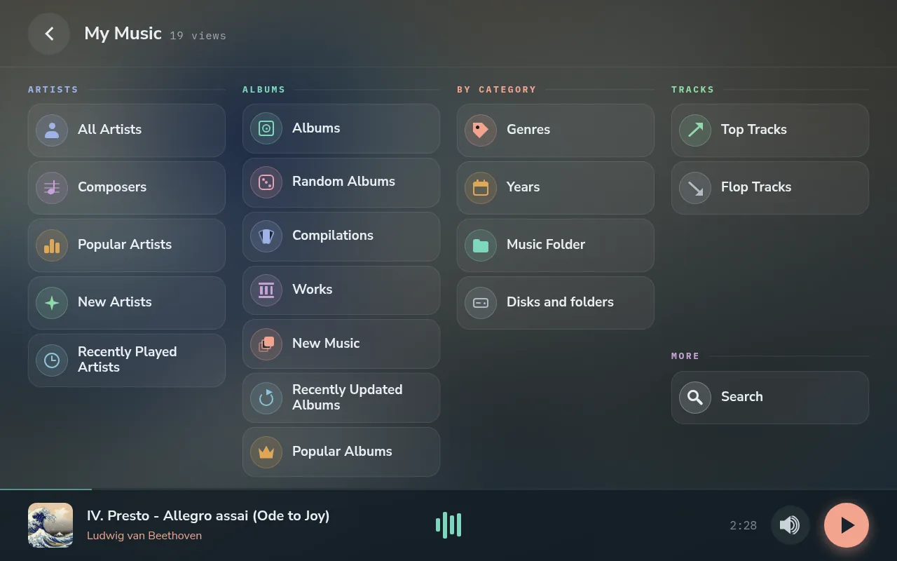

**My Music** groups Lyrion's library views:

| Group | Views |
| --- | --- |
| Artists | All Artists, Composers, Popular Artists, New Artists, Recently Played Artists |
| Albums | Albums, Random Albums, Compilations, Works, New Music, Recently Updated Albums, Popular Albums |
| By category | Genres, Years, Music Folder, Disks and folders |
| Tracks | Top Tracks, Flop Tracks |
| More | Search |

**Apps** lists the apps installed on your Lyrion server (streaming services,
internet radio and so on), each with its own logo and menus. A service's
first page can take a second or two to arrive; the panel says which service
it is waiting for.

**Search**: tap a search field and type on your phone (section 7); results
arrive as you type. My Music's Search looks for artists, albums, works,
songs and playlists at once.

A few things are left out on purpose:

- Lyrion's player settings, alarms and sync;
- album artists and playlists, which have their own cards on Home;
- entries that would change your streaming account (for example *Add to
  favourites*).

An album a service cannot stream in your region shows its tracks as *Not
available*.

## 5. When another source takes over

Only one source plays at a time. When you start Spotify, Bluetooth or
Plexamp from your phone, that source **takes over**: Lyrion pauses, a short
transition screen shows who took the player, and Now Playing shows the new
source. When that session ends, the player can give itself back to Lyrion
(*Settings → Handoff → Reclaim LMS when a session ends*, off by default), or
you can start Lyrion again from the panel.

Spotify starts at the **Starting volume** you set, however loud the Spotify
app was last time, so a takeover never starts at full volume.

## 6. The idle screen and the visualiser

After a while with nothing touched, the panel shows the **idle screen**: a
clock, the weather and a changing background picture. A touch brings back
what was there. *Settings → Display* sets when it appears and what it shows.

The **visualiser** shows a VU meter or spectrum from a collection of skins,
drawn from the music as it plays. Open it with the visualiser button on Now
Playing or from the phone; touch the screen to close it.

## 7. The phone page

Open the player's address in a phone's browser, for example
**http://gexis.local:8090** (the name is your player's, chosen at setup).
Nothing needs installing; the phone and the player only need to be on the
same network.

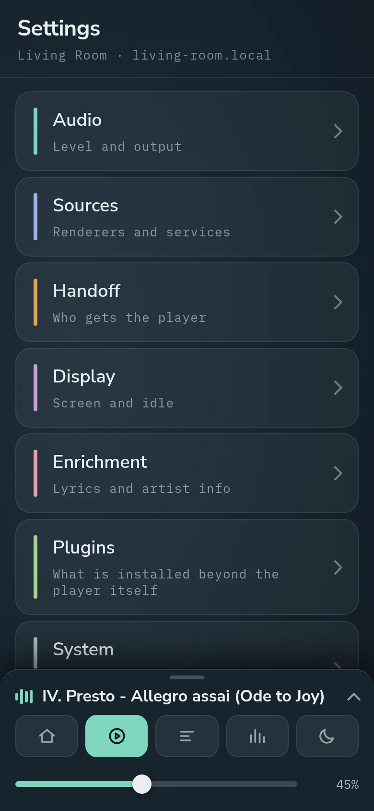

The phone page shows **Settings** above and the **mini player** at the
bottom:

- the track playing;
- a row of buttons for the panel: **Home**, **Now Playing** (lit while the
  panel shows it; tap again to minimise), **Lyrics**, **Visualiser** and
  **Idle screen**;
- the volume slider.

### The touchpad

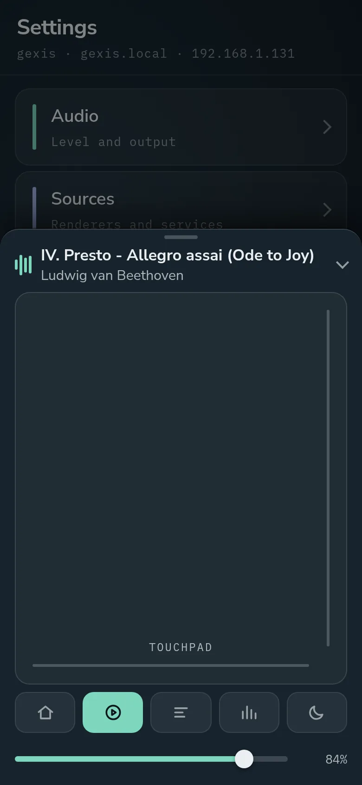

Tap the track name to open the sheet: its large area is a **touchpad** for
the panel, so you can drive the screen from across the room.

| Gesture | Does |
| --- | --- |
| One finger | Moves the pointer on the panel. |
| Tap | Presses what the pointer is on. |
| Two fingers up or down, or sideways | Scroll what is under the pointer. |
| One finger along the right or bottom edge line | Scrolls with one finger. |
| Pinch | Zooms the panel in or out around the pointer. |

Tap a text field on the panel (a search, for example) and the phone's
keyboard comes up: what you type appears on the panel. The pointer hides
after a few seconds of rest. *Settings → Display* sets **Pointer speed**,
**Pointer style** (Dot or Arrow), and whether the touchpad is offered at
all (**Phone touchpad**). A tap outside the open sheet just closes it, so
nothing behind it is pressed by mistake.

### Settings on the phone

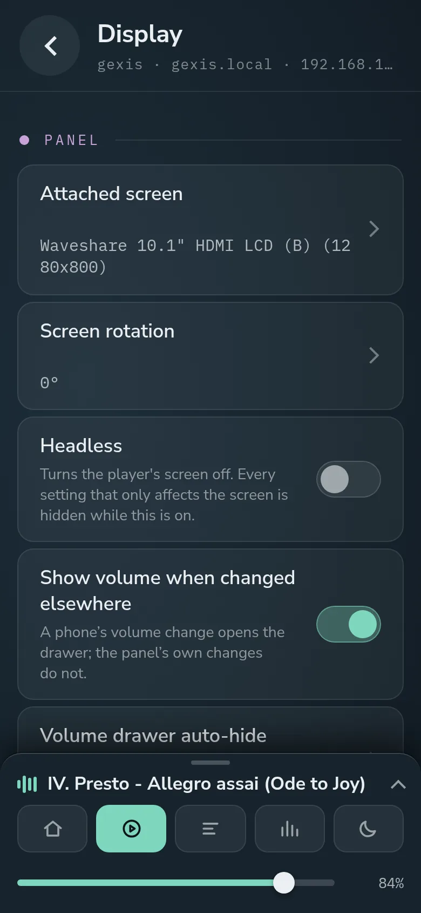

Every setting can be changed from the phone, which is the easier place to
type a name, a password or a key.

## 8. Bar screens

On a wide, short *bar* screen (1280 × 400 or 1480 × 320) the same player is
laid out in strips: Now Playing on one line, and the library's lists run
sideways. A tray pulled down from the top holds Home, the volume and the
visualiser.

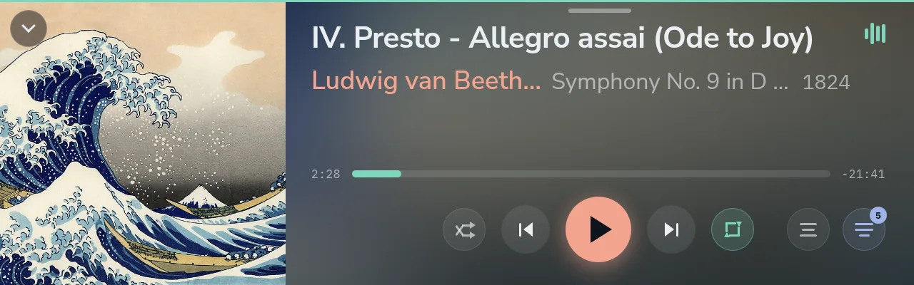

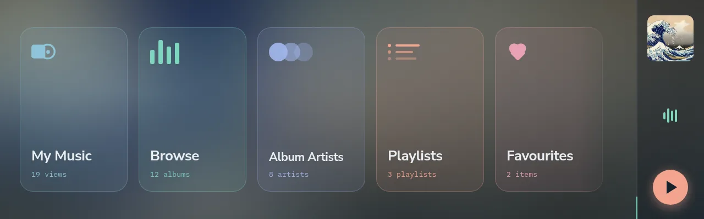

## 9. Settings

Settings is reached from the **Settings** card on Home, or on the phone
page. It is grouped into eight areas, listed down the left-hand side on the
panel.

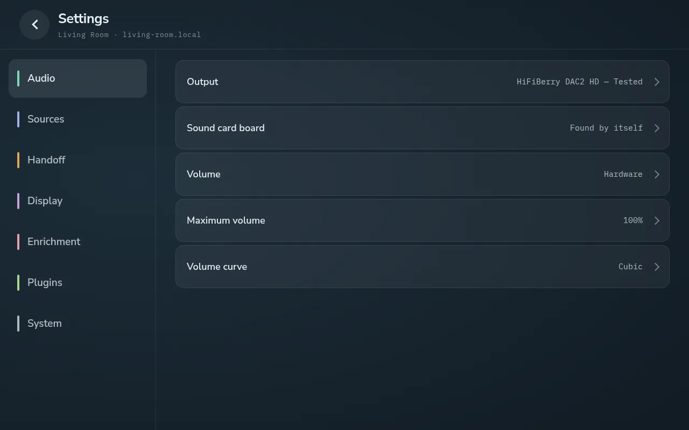

Tap a row to change it. A row that only applies in some cases (for example,
Spotify's *Starting volume* while Spotify is off) is hidden until it does.
Changes take effect at once unless the row says otherwise.

### Audio — *Level and output*

| Setting | What it does |
| --- | --- |
| Output | Where the sound goes. Over HDMI the volume is fixed, the sound is not bit-perfect and the visualiser does not move. |
| Sound card board | Most boards and every USB DAC are found by themselves. A board that is not (it does not show under Output) can be chosen here. |
| Output mode | *Variable*: the volume is set on the player. *Fixed*: the player always plays at full level, for an amplifier that sets the volume itself. Applies when playback next stops. |
| Maximum volume | The loudest the player will go, on any input. At 80, 100 % on every control means that level. |
| Volume curve | How the slider's travel maps to loudness. *Cubic* (half travel is −15.5 dB) is the usual shape; *Linear* puts half travel at −30 dB. |

### Sources — *Renderers and services*

| Setting | What it does |
| --- | --- |
| Lyrion Client: Enabled | Plays your Lyrion server's music. |
| Lyrion Client: Server | Which Lyrion server. Servers announce themselves on the network; typing an address is the fallback. |
| Lyrion Client: Extended navigation | Lyrion's own menus on Home: My Music, Favourites, Apps (section 4). |
| Spotify Connect: Enabled | The player appears as a Spotify Connect device. |
| Spotify Connect: Starting volume | The loudest Spotify starts at when it takes over. |
| Bluetooth: Enabled | The player accepts Bluetooth audio. |
| Bluetooth: Pairing | *Confirmation* shows a six-digit code on the panel to accept; *PIN-free* pairs anything in range. |
| Bluetooth: Discoverable | Whether phones can find the player: *Always*, *3 min after boot* (the default) or *Off*. |
| Bluetooth: Trusted devices | Remembered devices; forget one here. |
| Bluetooth: Auto-trust on pair | Remembers a device once paired, so it reconnects by itself. |

Plugins add their own rows here once switched on: **Plexamp** (claim the
player into your Plex account) and the **Lyrion Server** (a music server on
the player itself, with its music folders and network shares).

### Handoff — *Who gets the player*

| Setting | What it does |
| --- | --- |
| Restore transport on return | What Lyrion does when it gets the player back: *Play only if playing* (it resumes only if it was playing when it was taken), *Always pause* or *Always play*. |
| Reclaim LMS when a session ends | Off by default. On, when Spotify, Bluetooth or Plexamp stops, Lyrion takes the player back; a phone that locks can end a Spotify session and switch the player to Lyrion without warning. |
| Show transition screen | The short animation when one source takes over from another. |
| Transition screen length | How long it stays up. |

### Display — *Screen and idle*

| Setting | What it does |
| --- | --- |
| Attached screen | Sets the layout, Standard or Bar, and which visualiser skins are offered. |
| Screen rotation | For a screen mounted the other way up. |
| Headless | Turns the player's screen off; settings that only affect the screen are hidden while it is on. |
| Show volume when changed elsewhere | A phone's volume change opens the drawer; the panel's own changes do not. |
| Volume drawer auto-hide | How long the drawer stays when a change from elsewhere opened it. |
| Phone touchpad, Pointer speed, Pointer style | The phone's touchpad (section 7). |
| Home screen list, Items in the strip | What the row under Home's cards shows, and how many. |
| Idle screen: Screen, Timeout | The built-in clock-and-weather screen, or an external page; and after how long, with nothing playing and nobody touching the panel. |
| Idle screen: Background, Background brightness, Change the picture every | Artist pictures from the library, online wallpapers (Pixabay and Pexels, with a free key), or pictures on the device. |
| Idle screen: Wallpaper topics | Which kinds of wallpaper are drawn from. |
| Idle screen: Clock, Clock format, Weather, Location, Forecast, Weather icons | What the idle screen shows over the picture; forecasts come from Open-Meteo. |
| Visualiser: Timeout, Stop when nothing is playing | When the visualiser takes the screen while music plays, and when it gives it back. |
| Visualiser: Skin type, Rotate skin per track, Skin | Which skins it uses; tap a skin to preview it, then *Use this skin*. |
| Visualiser tweaks | How the bars and needles move, and whether turntables and tapes turn. |

### Enrichment — *Lyrics and artist info*

| Setting | What it does |
| --- | --- |
| Enrichment | Looks up what a source does not send: lyrics, biographies, covers, artist pictures. |
| Lyrics | Fetches lyrics, synchronised where available. |
| Look up missing artwork | Finds a cover for sources that send none (Bluetooth, radio). |
| ListenBrainz token | For the artist page's *Popular* list; a free token. |
| fanart.tv key, TheAudioDB key | Optional keys for artist pictures and album covers. |
| Confidence threshold | How sure the match must be (recommended 90 %). Below it, nothing is shown rather than something wrong. |
| Lyrion Client: Find portraits and covers | Looks up every album artist's portrait and every album's cover, keeps Lyrion's where none is found, and shows what the last run found. |

### Device — *Identity and network*

| Setting | What it does |
| --- | --- |
| Device name | One name for everything: the network address (*name*.local), the Lyrion player, the Spotify device and the Bluetooth name. |
| Wi-Fi | The networks the player knows. |
| Time zone | Taken from the network; set it by hand only when that is wrong. |
| Version | What is installed. |
| Reboot | Restarts the device; playback stops. |

### Plugins — *What is installed beyond the player itself*

Optional parts, each with its own switch: the **visualiser skins** for this
screen's size, **Plexamp**, the **Lyrion Server** and the **Beszel**
monitoring agent, among others. A plugin that needs software from its maker
downloads it when switched on. A plugin file can also be uploaded here.

### System — *Updates and maintenance*

| Setting | What it does |
| --- | --- |
| Software update | What is installed, what is waiting, and *Check for updates* / *Update* (section 10). |
| Change logs | What changed in the last 10 releases. |
| Updates | *Automatic* installs a waiting release at night, never while playing. |
| Update channel | *Testing* gets each release first, *Stable* once it has been tried. Recommended: Stable. |
| Back up now | Saves the settings, the library's pictures, the paired devices and the device's configuration into the Backups share. |
| Restore | Puts a backup back and restarts the device. |
| Debug logs | Keeps the logs across restarts, for tracking down a problem. |
| Legal, Credits | The licences, and everyone whose work is in the player. |

## 10. Updates

When a new release is waiting, **Settings → System → Software update** shows
it with its notes. **Update** runs six steps, each ticked as it finishes:

1. download;
2. back up the settings;
3. stop playback;
4. install;
5. restart the player;
6. check that it answers.

The panel shows the steps full-screen and keeps them up, all ticked, until
you press **Done**.

If something goes wrong during the install, the player puts the previous
release back by itself.
