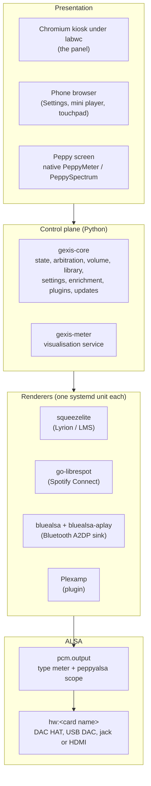
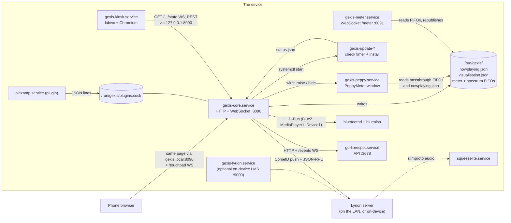
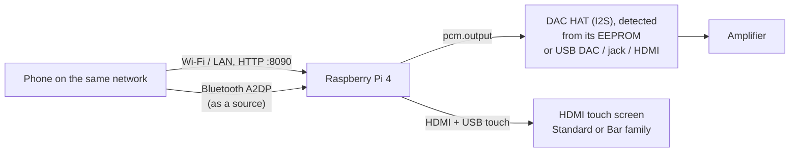

# Gexis Player: technical overview

Gexis Player is a music player appliance for the Raspberry Pi 4. It ships as a
flashable image (ADR-0021) built on Raspberry Pi OS Lite 64-bit (ADR-0001),
and everything on the card is ours to configure. That is what lets the project
claim the audio path can be checked by reading its ALSA configuration, rather
than hoping the user left the OS alone.

This page is the map. Each area has its own page:

| Page | What it covers |
|---|---|
| [audio-path.md](audio-path.md) | Renderers, the `output` device, volume, arbitration, the meter path |
| [core-and-state.md](core-and-state.md) | `gexis-core`: state, the `/state` socket, HTTP routes, settings, enrichment, menus, plugins |
| [ui.md](ui.md) | The Svelte page: panel and phone surfaces, screen families, the touchpad relay |
| [updates-and-releases.md](updates-and-releases.md) | Packages, release build, signing, the updater, the image build |
| [setup-and-network.md](setup-and-network.md) | First boot, the setup access point, the device name |

## Design rules that shape everything

These come up on every page, so they are stated once here.

- **One renderer holds the audio device at a time.** No mixing, no sound
  server: renderers write straight to ALSA (ADR-0008). Who holds the device is
  decided by the core's arbitration supervisor (ADR-0010, ADR-0027).
- **Nothing names a sound card by index.** Every renderer plays to the logical
  ALSA device `output` (ADR-0009), which is also the system default
  (ADR-0085). The card behind it is named, for example `hw:sndrpihifiberry`.
- **The core owns state; everything else renders it.** One Python daemon
  (ADR-0017) aggregates every renderer into one playback model and pushes it
  over a WebSocket. The UI and the phone are views of that state.
- **Everything stays resident.** Renderers stay loaded while idle, Chromium
  never restarts, and the visualiser is raised and hidden rather than
  started (ARCHITECTURE.md §10, ADR-0026). A source switched off in Settings
  is the exception: its unit is stopped and disabled (ADR-0077).
- **Plugins are separate processes** that speak JSON lines over a Unix socket
  (ADR-0016, ADR-0084). The built-in renderers describe themselves with the
  same manifest a plugin uses (ADR-0086), though their adapters still live
  inside the core process (ADR-0013 as amended).
- **We ship upstream renderers unmodified** (ADR-0093). Where something we may
  not redistribute is needed, the device fetches it itself when the user
  switches it on (ADR-0100).

## Layers

## Processes and how they talk

Every box below is a systemd unit. Unit files live in
`image/stage-gexis/*/files/` and `core/updater/units/`; they reach the device
inside our Debian packages (ADR-0107).

Notes on the diagram:

- **The core is the only server the UI talks to** (ADR-0028). It serves the
  built Svelte bundle from `/opt/gexis-ui`, the `/state` WebSocket and the
  REST command routes, all on port 8090 (`core/src/gexis_core/config.py`).
- **Panel and phone load the same page.** The core tells them apart by where
  the request comes from: loopback is the panel, anything else is a remote
  surface (`/surface` in `core/src/gexis_core/wsserver.py`; ADR-0032,
  ADR-0101).
- **The Peppy screen is not in the browser.** It is a native PeppyMeter
  window that labwc keeps behind Chromium; the core raises and hides it
  with `wlrctl` (`core/src/gexis_core/peppy.py`, ADR-0026).
- **The meter service runs as its own process** so the peppyalsa FIFOs have
  one reader (a FIFO splits bytes between readers). It republishes on
  passthrough FIFOs for PeppyMeter, a WebSocket and optionally PeppyMeter's
  HTTP format (ADR-0011, `core/src/gexis_core/meter_service.py`).
- **Lyrion (LMS) is normally on another machine.** The image ships no server
  address; it comes from setup or Settings, and with none, LMS is off
  (`config.py`). The on-device server is an optional plugin, off by default
  (ADR-0115).
- **Uploaded plugins** run under sandboxed template units,
  `gexis-uploaded-renderer@` and `gexis-uploaded-service@` (ADR-0106).

### Smaller units worth knowing

| Unit | Job |
|---|---|
| `gexis-screen-check.service` | Before the kiosk starts, notices a different screen and switches to it (ADR-0109) |
| `gexis-park.service` | On shutdown, asks the core to pause LMS so nothing resumes by itself at the next boot |
| `gexis-fetch@<name>.service` | Downloads pinned third-party software on the device (ADR-0100) |
| `gexis-panel-warmup.service` | Reads the kiosk's binaries into page cache before the kiosk needs them |
| `gexis-splash-backstop.*` | Quits the boot splash if the panel never reports a first frame (ADR-0043) |
| `gexis-bluetooth-setup.service` | Unblocks and powers the Bluetooth adapter before bluealsa |
| `beszel-agent` / `beszel-hub` | Optional system-metrics plugins (ADR-0087, ADR-0114) |

## Hardware path

- **DAC.** The bench board is the HiFiBerry DAC2 HD (`hw:sndrpihifiberry`).
  The HAT's EEPROM is read at boot, so the card name and its mixer control
  are discovered, not configured (`core/src/gexis_core/outputs.py`). The
  user picks which output plays (ADR-0055); an output without a hardware
  mixer is fixed-output, and the volume control is hidden (ADR-0046).
  Volume semantics are on [audio-path.md](audio-path.md).
- **Screen.** HDMI only. Screens fall into two families, Standard (around
  1280 x 800) and Bar (wide strips such as 1280 x 400), applied through
  Chromium's device scale factor and a known list of displays
  (ADR-0109, `core/src/gexis_core/screens_data/display_presets.json`).
  The visualiser's skin pack follows the screen size (ADR-0111). The player
  also runs with no screen at all.
- **Phone.** No app. A browser on the same network opens the device's page
  and gets Settings, a mini player, and a touchpad and keyboard for the
  panel (ADR-0101, ADR-0121). During first boot it is also how Wi-Fi is
  entered (ADR-0031).

`docs/HARDWARE.md` lists what has been tested, on which hardware.

## Where things live in the repository

| Path | Contents |
|---|---|
| `core/src/gexis_core/` | The core daemon (`__main__.py` wires it), the meter service, screen check |
| `core/updater/` | `gexis-update` and its units |
| `ui/` | The Svelte page for panel and phone |
| `packaging/` | One build script per Debian package, the release build and signing |
| `image/` | pi-gen wrapper, the `stage-gexis` stages, image verification |
| `skins/`, `design/` | Visualiser skins and design sources |
| `docs/decisions/` | ADRs; `docs/decisions/README.md` is the index |
| `docs/findings/` | Measured results, each with its scope |
