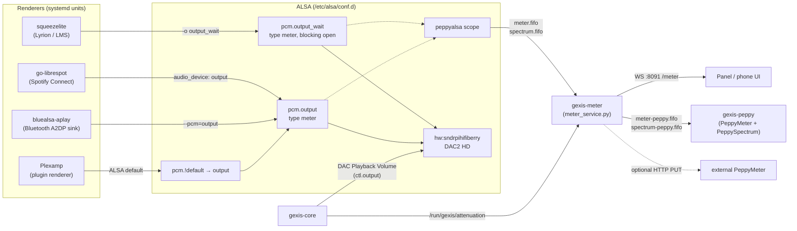
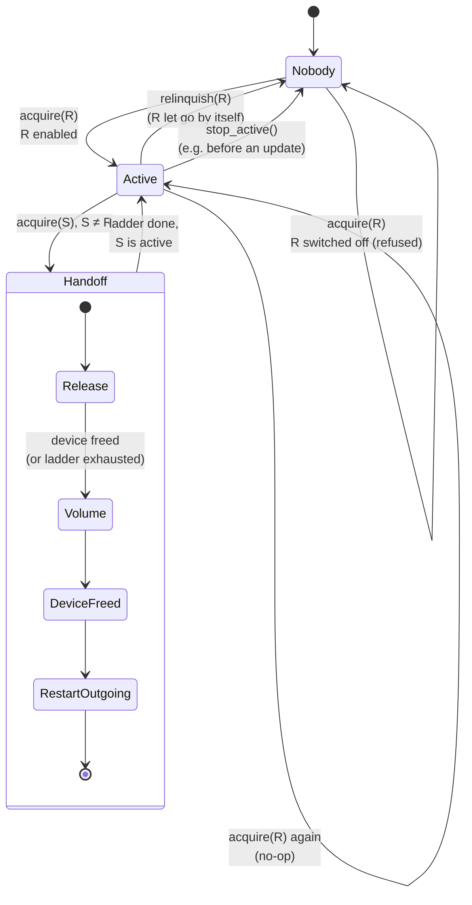
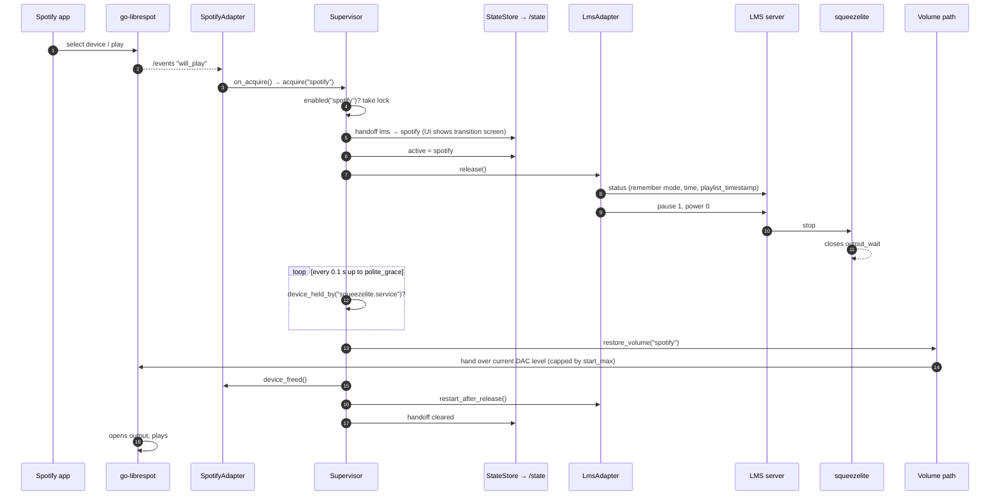
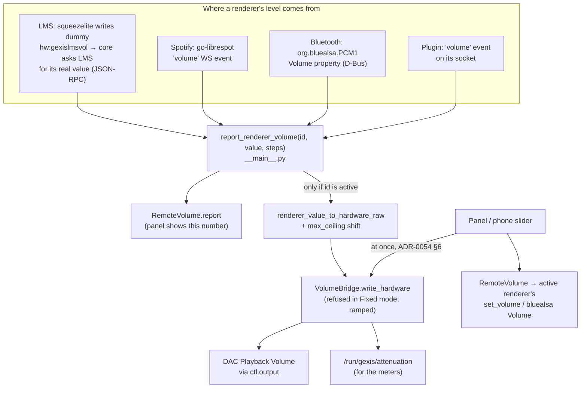
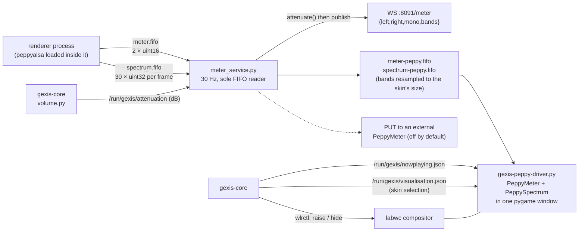

# The audio path

How sound gets from a renderer to the DAC, who decides which renderer may play,
how volume works, and how the meters and visualiser get their data.

The short version: **one renderer at a time writes to one logical ALSA device,
`output`; the core daemon decides who that is; volume is applied once, in the
DAC's own hardware attenuator; and a tap inside `output` feeds the
visualiser.** There is no sound server and no mixing (ADR-0008).

## The audio graph

Every arrow into the DAC is a single, unconverted stream. The DAC advertises
S16_LE, S24_LE and S32_LE at 44.1–192 kHz; a format it does not take is
refused rather than converted, because nothing in the chain is a `plug`
(ADR-0009), with one deliberate exception for HDMI described under
[Choosing an output](#choosing-an-output).

## The logical device

`image/stage-gexis/00-alsa/files/output.conf` is installed as
`/etc/alsa/conf.d/output.conf` and defines everything a renderer touches:

| Name | What it is | Who uses it |
|---|---|---|
| `pcm.output` | `type meter` over `hw:sndrpihifiberry`, with the peppyalsa scope | go-librespot, bluealsa-aplay, and (through `default`) Plexamp |
| `pcm.output_wait` | The same chain, but the slave is opened with `nonblock 0` so a busy DAC makes the open *wait* instead of failing (ADR-0095) | squeezelite only |
| `gexis_softvol`, `gexis_softvol_wait` | **With Volume on Software (ADR-0124, ADR-0127):** `meter → softvol → card`; on HDMI `softvol → plug → card`. One control for both, `Gexis Playback Volume` (`Gexis` to amixer), -90..0 dB in 0.25 dB steps; at 0 dB it passes every sample unchanged (Finding 115). The core makes the control at start and sets the saved level before anything plays (ALSA would make it at 0 dB), parks the card's own control at 0 dB only after that level reads back, and gives the card the level back when Hardware is chosen again. On every change of output the core closes its mixer handles and frees libasound's cached configuration (`volume.forget_mixers`): a running process otherwise keeps resolving `output` to the card it first saw | every renderer, through `output` / `output_wait` |
| `ctl.output` | The DAC's control interface, so `amixer -D output` and the core reach the hardware mixer by name | gexis-core |
| `pcm_scope.peppyalsa` | Level and 30-band spectrum analysis, written to FIFOs in `/run/gexis` | loaded inside whichever renderer has the device open |

`zz-gexis-default.conf` adds `pcm.!default "output"` (ADR-0085). It exists
for software that builds its own device list and cannot be pointed at a
custom PCM name; Plexamp is the case that forced it.

**The card is always named, never numbered.** The HiFiBerry's index differs
between machines because the onboard audio devices come first; everything
uses `hw:sndrpihifiberry` or the `output` indirection. `core/src/gexis_core/alsa.py`
resolves the id to a number only at the moment it needs a `/dev/snd` path.

Why `output_wait` is squeezelite's alone: alsa-lib opens `hw` devices
non-blocking by default, so a renderer that opens while the previous one is
still releasing gets `EBUSY` at once. squeezelite then sleeps a fixed 5 s;
a blocking open removes that gap. Only one renderer is allowed to wait, so
two waiters can never deadlock each other (ADR-0095 as amended).

## The renderers

Renderers are upstream binaries, run as shipped; we configure them but do
not build or patch them (ADR-0093). Each is a systemd unit. The core talks to
each through that renderer's own control API, via an **adapter**
(`core/src/gexis_core/adapters/`).

| Renderer | Unit | Control channel (adapter) | Acquisition event | Release |
|---|---|---|---|---|
| Lyrion (LMS) | `squeezelite.service` | LMS JSON-RPC + CometD push (`adapters/lms.py`) | the player's LMS **power** going on (`power_on`) | record transport + position, `pause 1`, `power 0` |
| Spotify Connect | `go-librespot.service` | go-librespot local HTTP API + `/events` WebSocket on port 3678 (`adapters/spotify.py`) | `will_play`, `active` or `playing` events | `POST /player/pause`, short settle, `POST /player/stop` |
| Bluetooth | `bluealsa-aplay.service` (with `bluealsa` and BlueZ) | BlueZ over D-Bus (`adapters/bluetooth.py`) | `MediaTransport1` or `MediaPlayer1` appearing | `Device1.Disconnect()` |
| Plugin renderer (Plexamp) | the unit named in the plugin's manifest | JSON lines over a Unix socket (`adapters/plugin.py`, ADR-0084/0089) | the plugin sends `acquire` | the plugin is sent `release`, then the core kills the unit (ADR-0091) |

Notes per renderer:

- **squeezelite** runs `-o output_wait -O hw:gexislmsvol -V Master -C 1`.
  `-C 1` closes the device after one idle second. `-O/-V` point its mixer at
  a private dummy control rather than the DAC (see [Volume](#volume)).
  `squeezelite-mixer-check.sh` runs as `ExecStartPre` and refuses to start if
  that control is missing, because squeezelite would otherwise fall back to
  software volume silently (ADR-0018). The player name comes from
  `/etc/gexis/device-name.env` (ADR-0048).
- **go-librespot** is configured (`go-librespot-config.yml`) with
  `audio_device: output`, `external_volume: true` (it never attenuates the
  stream itself) and `normalisation_disabled: true`, so Spotify reaches the
  DAC at full scale like the other renderers (ADR-0052 §6). Its API listens
  on a fixed port so the adapter can find it. The device name in that file is
  rewritten by `core/src/gexis_core/device_name.py`.
- **Bluetooth** is A2DP sink only (`bluealsa -S -p a2dp-sink`).
  `bluealsa-aplay --pcm=output --volume=none` keeps bluealsa in pass-through
  mode: no software volume, and no mixer for it to write. The core reads and
  writes the phone's level directly over bluealsa's D-Bus API
  (`bluealsa_volume.py`, ADR-0054 §1). Pairing is confirmed on the panel by
  the core's own BlueZ agent (ADR-0045).
- **Plexamp** is not in the image's renderer stage. The `gexis-plexamp`
  plugin package (ADR-0090) carries the bridge and the units; Plexamp itself
  is downloaded on the device by a pinned URL and checksum when it is switched
  on, because it may not be redistributed (ADR-0100). It reaches `output`
  through the ALSA default (ADR-0085). Because Plexamp holds the device for
  ~14 s after a stop and has no setting to shorten it, the core takes it off
  the device by killing its unit rather than waiting (ADR-0091); a new play
  queue counts as an acquisition (ADR-0092). It is claimed from Settings
  (ADR-0119).
- **Any renderer plugin** declares its capabilities in its `hello`
  (`docs/PLUGIN-CONTRACT.md`): acquisition events, release action, an
  optional release ladder, controls, and how its volume is handled.
  `capabilities_from()` in `adapters/plugin.py` refuses a declaration it
  cannot act on rather than defaulting it.

A source switched off in Settings has its unit **stopped and disabled**, not
just ignored, and the supervisor refuses an acquisition from it whatever
fires (ADR-0077; `renderer_enabled()` in `__main__.py`). LMS is also treated
as off when no server is configured.

The Lyrion *server* is a separate optional plugin that runs on the device
itself (ADR-0115); squeezelite does not care whether its server is local or
elsewhere on the network.

## Arbitration: who holds the device

`core/src/gexis_core/arbitration.py` is the `Supervisor`. It is pure policy:
it never touches ALSA or a renderer directly, only adapters and two injected
callables (`device_busy`, `restore_volume`). The model, from ADR-0010 as
changed by ADR-0027:

- **At most one renderer is active. "Nobody" is a normal state**, not an
  error, and it is where the device sits between sessions.
- **Acquisition is a deliberate act** (a phone selecting the device, a phone
  connecting, LMS being powered on), never "audio started". Notification
  sounds from a connected phone must not steal the device.
- **The newest acquisition wins.** Whoever held the device is released.
- **Not a stack, no history.** When a renderer lets go, nothing is restored
  and nothing resumes on its own.
- **A takeover acts through the outgoing renderer's control channel**, so the
  app on the phone shows the truth (disconnected, paused) rather than
  "playing" into silence.

### The release ladder

Releasing is escalated, and every rung **polls** whether the outgoing
renderer's own process still holds the PCM (every 0.1 s), rather than sleeping
the whole grace period:

1. **Polite**: `adapter.release()` through the renderer's API, then up to
   `polite_grace` (default 3 s).
2. **First signal**: `adapter.signal_stop(force=False)`, then `sigterm_grace`
   (3 s).
3. **Second signal**: `signal_stop(force=True)`, then `sigkill_grace` (2 s).

"Still holds the device" is `alsa.device_held_by(unit)`: is that unit's PID
among the holders of the card's playback node. Checking "is anyone holding
it" would be wrong, because by then the incoming renderer may legitimately
have opened it. The card checked is whichever output is configured, not
always the HiFiBerry (ADR-0055).

The built-in adapters and the plugin adapter all send **SIGKILL** on both
signal rungs. A SIGTERM'd squeezelite, go-librespot or Plexamp exits cleanly,
and `Restart=on-failure` does not count a clean exit as a failure, so it
would never come back. A plugin may declare its own ladder (Plexamp declares
no polite grace, ADR-0091). Every call into a renderer's API while the
supervisor holds its lock is bounded at 2 s (`RENDERER_CALL_TIMEOUT_S`), so a
renderer that stops answering cannot stall later takeovers.

### A takeover, end to end

Spotify taking the device from a playing LMS:

Details worth knowing:

- **The handoff is published before the new active renderer**, so the panel
  covers the screen before the incoming artwork can flash. The transition
  screen shows on every takeover for at least `handoff_duration` (default
  1.5 s), longer if the takeover is still in flight (ADR-0094).
- **Release before volume.** The incoming renderer's level is applied only
  after the outgoing one has let go; otherwise the outgoing audio would
  briefly play at the new level.
- **LMS pauses before powering off.** A playing player powered off comes back
  "playing" and squeezelite tries to open the device immediately; pausing
  first avoids that. When LMS later takes the device back, its
  `device_freed()` resumes playback and seeks back to the recorded position,
  but only if `playlist_timestamp` shows the queue was not changed meanwhile
  (ADR-0027). The `restore_transport` setting can override whether it resumes.
- **Echoes of our own release are harmless.** Releasing LMS makes LMS report
  "powered off"; that arrives as `relinquish("lms")`, which the supervisor
  ignores because LMS is no longer the active renderer.
- With `reclaim_lms` on, a session ending with nobody holding the device
  powers LMS back on (`_reclaim_lms()` in `__main__.py`).

## Volume

### Volume: Hardware, Software or Fixed

One setting, `output_mode` (ADR-0127; it merged ADR-0124's Software volume
toggle into ADR-0046's Output mode).

| Mode | What happens | Claim |
|---|---|---|
| **Hardware** (default; was *Variable*) | The DAC's hardware attenuator (`DAC Playback Volume`, 0–240 in 0.5 dB steps) sets the level. Samples reach the DAC unmodified. | Bit-perfect up to the DAC chip |
| **Software** | `meter → softvol → card` (HDMI: `softvol → plug → card`); the card's own control parked at 0 dB. On an output with no control of its own, `Settings.restrict` greys Hardware and `Settings.value` answers Software, the next option (`volume_mode()` in `__main__.py` for start-up). | Bit-perfect at 100 % only (Finding 115) |
| **Fixed** | The DAC is set to 240 (0 dB) and nothing may write it; the amplifier sets the level. Volume controls are hidden, with a padlock and a reason, not greyed (ADR-0046). | Nothing in the signal path is touched |

Switching to Fixed while playing waits until playback stops, because a jump to
full scale into an amplifier set for a quieter signal is the loudest mistake
the device can make (ADR-0018, ADR-0046; `_apply_output_mode()` in
`__main__.py`). An output with no volume control (HDMI) no longer forces Fixed: Software
takes Hardware's place there (ADR-0127). Between Hardware and Software the
chain changes, so the renderers restart with the level carried across. In code, `volume.fixed_output()` gates `VolumeBridge.write_hardware()`,
the one function every write to the DAC goes through.

### One DAC, many sliders

Every renderer has its own volume slider in its own app, and all of them must
end up on one hardware control without fighting over it. The rules, from
ADR-0053 and ADR-0054:

1. **The renderer's own number is the truth.** The panel is a remote control
   for the active renderer: it shows that renderer's number and sends the
   panel's changes to that renderer. LMS at 25 shows 25 on the panel.
2. **One curve, ours.** The core maps a renderer's value onto the DAC with a
   single function, `renderer_value_to_hardware_raw(value, steps)` in
   `core/src/gexis_core/volume.py`. Default is cubic over a 60 dB span; zero is
   silence; the `travel_curve` setting can switch to linear-in-dB.
3. **Only the active renderer reaches the DAC.** Reports from inactive
   renderers are kept for display but never applied.
4. **A renderer's value is never sent back to it.** The panel's 101 positions
   cannot represent AVRCP's 128 values exactly, so echoing a renderer's own
   value back creates a ratchet. `RemoteVolume.report()` is inbound only.
5. **A first report above the level playing is answered, not followed**
   (`start_guard.py`). After a takeover that hands a starting volume
   (Spotify, a plugin declaring `volume_handed`), after a takeover by a phone
   that has not yet said its level, and for 30 s after a change of output
   restarts the renderers, a report louder than the level playing is answered
   by sending that level back through the renderer's own channel (its API, or
   the phone's AVRCP level). A phone's remembered level or a restarted
   go-librespot's 100 is not a hand on the slider. The level sent is ours, never
   the renderer's own value, so rule 4 holds.

Mechanics behind the picture:

- **Dummy controls.** squeezelite always writes *some* mixer when LMS changes
  its volume, whether or not it is the active renderer. So it is pointed at
  `hw:gexislmsvol`, a `snd-dummy` card with no audio path
  (`gexis-dummy-mixers-modprobe.conf`). A change there is only a signal: the
  `DummyMixerBridge` sees it, waits for the control to settle (LMS fades the
  volume on pause, and the fade must not be taken as a level), and the core
  asks LMS over JSON-RPC what its volume really is (ADR-0054 §2). A second
  dummy, `gexisbtvol`, is still created but no longer used.
- **Ramping.** `write_hardware()` walks the DAC to a new target in 0.5 dB
  steps, capped at about 120 ms, so a slider drag that arrives as a few
  samples sounds like a slide rather than a staircase. A newer target cancels
  the ramp in flight; the final target is always written (ADR-0052 §4).
- **Echo suppression** in `VolumeBridge` is value-matched: it drops exactly one
  incoming report that carries the value it just wrote, never a time window,
  so a fast genuine drag is never swallowed.
- **On acquisition** the renderer is *asked* where its level is
  (`acquire_volume()`), and that value is applied. Renderers whose answer is
  not meaningful (go-librespot under `external_volume`, plugins declaring
  `volume_handed`) are instead *handed* the level already playing, capped at
  `start_max` (`hand_level_to()`, ADR-0054 §5). A short start guard ignores a
  phone's slider arriving as it connects.
- **Ceiling.** `max_ceiling` (a percentage) shifts the top of every scale down
  rather than clipping, so 100 in any app means the ceiling (ADR-0052 §3).
- **Mute** remembers the level and writes 0; any other change ends mute
  (ADR-0034).

### Choosing an output

`core/src/gexis_core/outputs.py` (ADR-0055) discovers playback cards (skipping
the dummy cards), labels them, and notes which have a volume control and
whether an HDMI connector has anything plugged in. Choosing one rewrites the
card name in `output.conf` and restarts the renderers and the core, because
ALSA reads the file only when a PCM is opened, and each card brings its own
control name (`DAC` on the HiFiBerry, something else on the headphone jack,
none on HDMI).

HDMI accepts only IEC958 subframes, so no renderer can open it raw. For a card
like that, `render()` writes `type plug` **instead of** the meter: conversion
is allowed only where bit-perfect is already impossible, and the meter is
dropped because a meter over a plug crashes the renderers. On such an output
there is no volume control, no bit-perfect claim and no visualiser levels;
the Settings row says so.

## Meters and the visualiser

- **The tap.** `pcm.output` is `type meter` with the peppyalsa scope, so the
  analysis runs inside whichever renderer has the device open and writes two
  FIFOs in `/run/gexis` (not `/tmp`: bluealsa-aplay has a private `/tmp`).
  peppyalsa never blocks audio when nobody reads the FIFOs. The image applies a
  small patch so each spectrum frame is written in one `write()`
  (`peppyalsa-one-write-per-frame.patch`), giving readers whole records.
- **One reader, three transports** (ADR-0011). A FIFO splits bytes between
  readers, so `gexis-meter` (`core/src/gexis_core/meter_service.py`, its own
  unit, kept out of the core's event loop) is the only reader. It republishes
  on a WebSocket for the UI, on a pair of passthrough FIFOs for our PeppyMeter,
  and optionally by HTTP PUT to an unmodified PeppyMeter elsewhere.
- **Levels follow the volume** (ADR-0057). The tap is before the DAC's
  attenuator, so the service reads the attenuation the core publishes and
  lowers the levels by a third of it (`METER_VOLUME_TRACKING`), mapping the
  volume's 60 dB onto a VU dial's ~20 dB.
- **The spectrum frame matches its reader** (ADR-0056). peppyalsa measures 30
  bands; a skin draws 20–22. The passthrough reads the spectrum engine's
  declared `size` and folds bands to that count by peak, so the reader never
  reads across frame boundaries.
- **Movement is configurable**: needle fall time, needle smoothing and
  spectrum smoothing are settings (ADR-0058). The first two regenerate
  `output.conf`'s peppyalsa section; needle smoothing is PeppyMeter's own
  config and needs `gexis-peppy` restarted.
- **The Peppy screen is a native process**, not a browser page (ADR-0026).
  `gexis-peppy.service` runs `gexis-peppy-driver.py`, which drives the
  vendored PeppyMeter and PeppySpectrum engines (packaging/peppy-engines) in
  one pygame window. It keeps rendering while hidden; the core raises and
  hides the window through labwc with `wlrctl` (`core/src/gexis_core/peppy.py`),
  which is why entry is instant. Entry is the button or five minutes of
  unattended playback; a renderer change lowers it (ADR-0036).
- **What it draws besides levels.** The core writes
  `/run/gexis/nowplaying.json` (`peppy_metadata.py`) for title, artist,
  artwork and times, and `/run/gexis/visualisation.json` (`skins.py`) for the
  selected skin (ADR-0051). Missing fields blank their region, never the
  screen (ADR-0014).
- **External displays.** `metadata_file.py` also writes moOde's
  `/var/local/www/currentsong.txt` key=value format, so displays built for
  moOde work unchanged.

## Where to look

| Topic | Code | Config |
|---|---|---|
| ALSA chain | `core/src/gexis_core/alsa.py`, `outputs.py` | `image/stage-gexis/00-alsa/files/` |
| Renderer units | `core/src/gexis_core/systemd.py` | `image/stage-gexis/02-renderers/files/` |
| Arbitration | `core/src/gexis_core/arbitration.py`, `adapters/` | — |
| Volume | `core/src/gexis_core/volume.py`, `remote_volume.py`, `bluealsa_volume.py`, `start_guard.py`; wiring in `__main__.py` | `settings_registry.json` (Audio rows) |
| Meters | `core/src/gexis_core/meters.py`, `meter_service.py` | `output.conf` peppyalsa section |
| Peppy screen | `core/src/gexis_core/peppy.py`, `peppy_metadata.py`, `skins.py` | `image/stage-gexis/05-peppy/files/` |
| Plugin renderers | `core/src/gexis_core/adapters/plugin.py`, `plugin_server.py` | `docs/PLUGIN-CONTRACT.md` |
