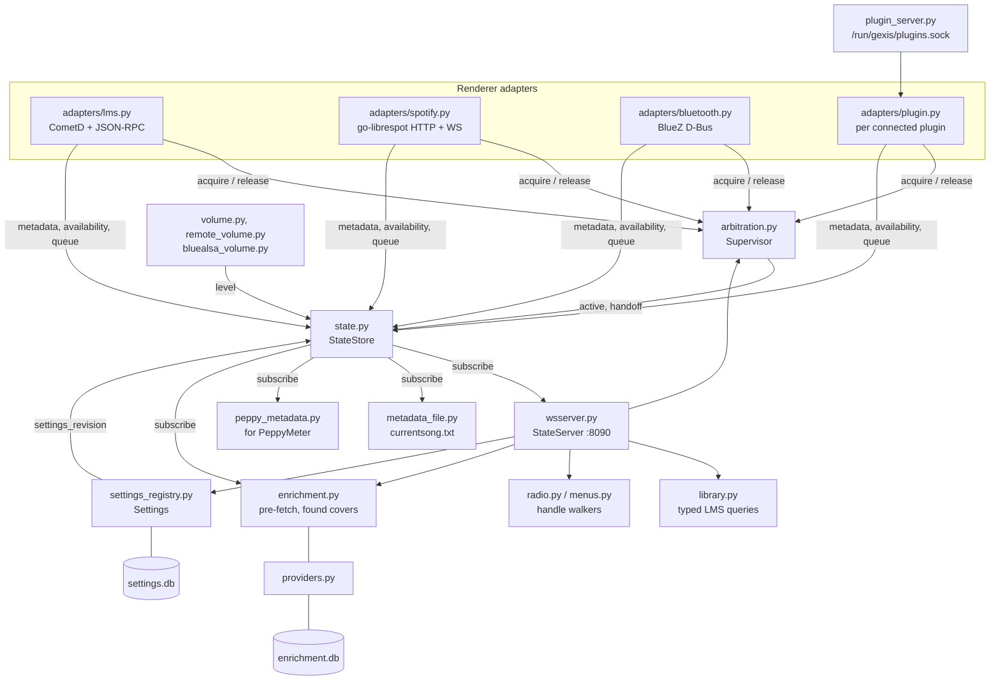
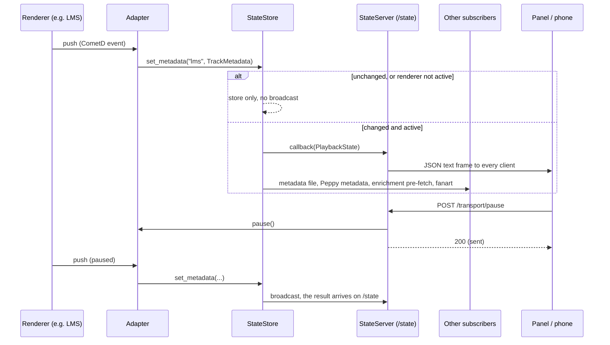
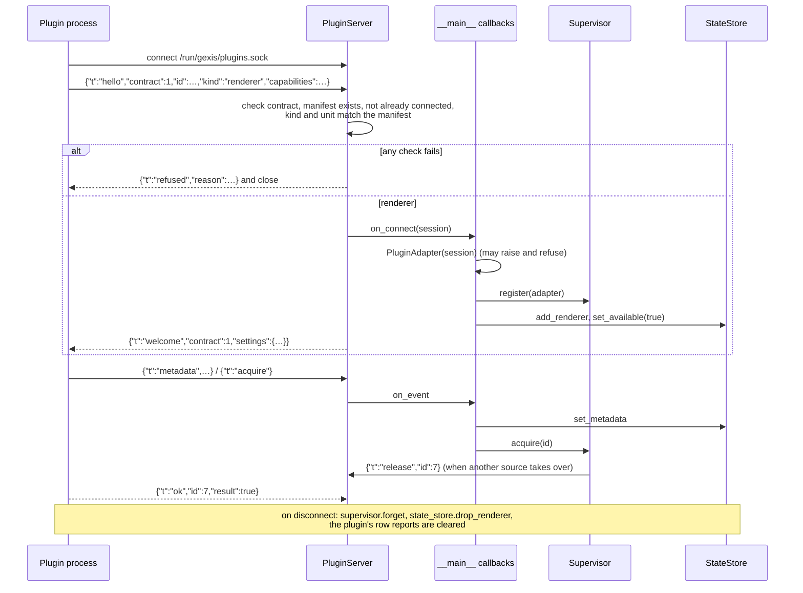

# gexis-core: the daemon, its state and its API

`gexis-core` is one Python process (ADR-0017) run by `gexis-core.service`
(`python -m gexis_core`, from `/opt/gexis-core/venv`). It owns the playback
model, arbitrates who holds the audio device, serves the UI bundle and its
API, stores settings, enriches what is playing and hosts the plugin socket.
Everything below lives in `core/src/gexis_core/`.

Two things it is **not**: the meter/visualiser feed is a separate process
(`gexis-meter.service`, `meter_service.py`, ADR-0011) so a 30 Hz loop never
shares the daemon's event loop; and the updater is a separate program
(`core/updater/gexis-update`, see `updates-and-releases.md`).

## Process structure

`__main__.py:main()` is a single long wiring function. It builds objects in
dependency order, connects them with callbacks, then hands the long-running
coroutines to one `asyncio.gather`. There are no threads of note; blocking work
(SQLite, file I/O, `tar`) goes through `asyncio.to_thread`.

Start-up order, in brief:

1. `Config.load()` reads `/etc/gexis/core.toml` (deployment config, TOML,
   unknown keys are an error) - see [Configuration](#configuration-two-layers).
2. `SettingsStore()` opens `/var/lib/gexis-core/settings.db`, then
   `settings_migrations.migrate()` runs before anything reads a setting.
3. The output is resolved (`outputs.resolve`, ADR-0055): this decides the
   mixer control name and whether the chain carries a meter. When Volume is
   on Software it also swaps in the software stage (`Gexis`) as the control
   and makes it (ADR-0124, ADR-0127). Meters are available when the software
   stage is in the chain or the card needs no conversion.
4. The three built-in adapters are built: `LmsAdapter`, `SpotifyAdapter`,
   `BluetoothAdapter`.
5. Plugin manifests are read (`plugins.installed()` plus `uploads.installed()`),
   so the built-ins and any plugin are described the same way (ADR-0086).
6. `StateStore` is built from the adapters' capabilities and the manifests.
   Subscribers are attached: the moOde-style metadata file, the Peppy metadata
   writer, the enrichment pre-fetcher, the fanart follower and the WebSocket
   server.
7. Volume bridges, mute, the remote-volume model (ADR-0053/0054), the
   arbitration `Supervisor`, the `Settings` registry with its wired callbacks,
   the library, enrichment, menus and radio walkers, and the `StateServer`.
8. `PluginServer` is built last, with callbacks into the supervisor and the
   state store.

The `gather` at the end of `main()` runs, for the life of the process:

| Task | What it does |
|---|---|
| `_run_renderer(id, adapter, …)` per built-in | Runs `adapter.run()` while that source's row is on and cancels it when off (ADR-0077) |
| `volume_bridge.run()` | Spotify's two-way volume sync with the output's volume control |
| `bluetooth_volume.run()` | Bluetooth's level over bluealsa's D-Bus API (ADR-0054 §1) |
| `DummyMixerBridge.run()` per dummy-mixer renderer | Mirrors LMS's private snd-dummy control onto the output's volume control while LMS is active |
| `peppy.run()` | The visualiser screen's lifecycle (ADR-0019/0026/0036) |
| `wifi.watch_connected()` | Keeps the Wi-Fi row's value current off the request path |
| `setup_network.run()` | First-boot setup network (ADR-0104) |
| `plugin_server.run()` | The plugin socket (ADR-0084) |
| `state_server.run()` | The HTTP/WebSocket server |

Many smaller background jobs are started with `asyncio.ensure_future` during
wiring (source reconciliation, debug-log state, component downloads, update
follower, skin-pack and preview jobs, the Lyrion-folders loop).

## The playback model and the state store

`model.py` defines frozen dataclasses: `TrackMetadata`, `Handoff`,
`VolumeState`, `Queue` and `PlaybackState`. `PlaybackState` **is** the payload
of the `/state` WebSocket; `to_json()` is its wire form.

`state.py:StateStore` is pure aggregation with no I/O. It keeps per-renderer
metadata, queues and availability, plus who is active, and computes one
`PlaybackState` snapshot on demand. Rules worth knowing:

- **Metadata is stored for every renderer but broadcast only for the active
  one**, and only when it differs from what was stored. A renderer that
  becomes active has something to show at once.
- **"Nobody holds the device" is normal** (`active: null`, ADR-0027), not an
  error.
- **A cover the daemon found** for a renderer that sent none is applied only
  while the renderer's own artwork is absent and only for the track it was
  found for (ADR-0081).
- `settings_revision` and `pictures_revision` are counters: a client
  refetches `GET /settings`, or drops its artist photos, when one moves.

Top-level fields of the `/state` payload:

| Field | Meaning |
|---|---|
| `active`, `available` | Who holds the device; which renderers are reachable |
| `metadata` | The active renderer's track (title, artist, album, artwork, rate, position, transport, …) |
| `capabilities`, `controls` | Each renderer's declared contract; the active renderer's transport commands that work now, with its shuffle and repeat state where it declares them (ADR-0037) |
| `sources` | One entry per installed source from its manifest: name, kind, accent, mark URL (ADR-0086) |
| `handoff` | A takeover in progress, for the transition screen (ADR-0094) |
| `volume`, `fixed_output`, `meters` | Level; whether there is no attenuation at all (ADR-0046); whether the output can feed the visualiser (ADR-0055 §6) |
| `queue` | The active renderer's queue, where it has one |
| `pairing` | A Bluetooth pairing request awaiting an answer on the panel (ADR-0045) |
| `components` | Progress of on-device downloads (ADR-0100) |
| `panel` | What the panel shows, and the phone's requests to it (ADR-0101, ADR-0122) |
| `setup` | First-boot setup status, never the password (ADR-0104) |
| `update` | The updater's status, read from its status file (ADR-0110) |
| `screen_confirm`, `screen_new` | The "keep this screen?" and "new screen attached" questions (ADR-0109) |
| `screen_check` | The hardware feedback's test pattern and the measured corner taps (ADR-0126) |
| `settling` | The first start after setup, until its downloads have finished: `phase` and each item's state (ADR-0128) |
| `settings_revision`, `pictures_revision` | Refetch triggers |

### How a change reaches the screen

The socket is **publish-only** (ADR-0028). A client gets one full snapshot on
connect and a full snapshot on every change; there are no deltas and no
polling. Commands are HTTP requests: a `200` means "sent", and what actually
happened arrives on `/state`. The UI client is `ui/src/lib/state.js`, which
reconnects on its own.

## The HTTP and WebSocket API

`wsserver.py:StateServer` is an aiohttp app bound to `0.0.0.0:8090` (from
`Config.state_host`/`state_port`). It holds no policy: every handler calls
something injected by `__main__.py`. The API is open to the LAN and
unauthenticated by decision (ADR-0028); the walkers' handle model below exists
partly because of that.

**Panel or phone?** The panel's kiosk always connects over loopback and a phone
from the LAN, so `request.remote` is the discriminator (ADR-0035 §6). A few
routes are loopback-only or behave differently by origin: `/surface`,
`/touchpad`, `/setup/status` (the setup password goes to the panel only),
`/panel/painted`, `/screen/{action}` and `/renderers/park`.

| Group | Routes | Used by |
|---|---|---|
| State | `GET /state` (WebSocket) | Panel, phone |
| Surface | `GET /surface` → `panel` or `remote` | Both, at start (ADR-0032) |
| Touchpad relay | `GET /touchpad` (WebSocket) | Phone ↔ panel (ADR-0121) |
| Playback | `POST /renderer/{id}/activate`, `POST /transport/{command}`, `POST /volume`, `POST /volume/mute` | Both |
| Panel view | `POST /touch`, `POST /panel/painted`, `POST /panel/shown`, `POST /panel/idle/{show,hide}`, `POST /panel/go/{to}`, `POST /peppy/{action}` | Panel reports; phone asks |
| Idle screen | `GET /idle`, `/idle/weather`, `/idle/wallpaper`, `/idle/wallpaper/{name}`, `/idle/wallpaper/local/{path}` | Panel (ADR-0047) |
| Library | `GET /library/{counts,strip,new,artists,playlists}`, `/library/artists/{id}/{albums,genres}`, `/library/albums/{id}`, `/library/playlists/{id}`, `/library/artist-photos`, `/library/artist-info`; `POST /library/action` | Panel (ADR-0038) |
| Radio | `GET /radio?handle=…`, `POST /radio/play` | Panel (ADR-0030) |
| Lyrion menus | `GET /menus`, `/menus/browse`, `/menus/letters`; `POST /menus/act`, `/menus/search` | Panel, when Extended navigation is on (ADR-0118) |
| Enrichment | `GET /enrichment` | Panel, phone |
| Settings | `GET /settings`; `PUT /settings/{key}` (write a value); `POST /settings/{key}` (run an action); `GET`/`POST /settings/{key}/items` (list rows: Wi-Fi, trusted devices, backups, `lyrion-server.shares`, `lms_server`); `GET /network/wifi` (the connected network's signal, speed, band, channel and address, no rescan - ADR-0123); `GET /notices/{name}` (Legal, Credits) | Both (ADR-0035) |
| Skins and plugins | `GET /skins`, `/skins/{name}/preview`, `/plugins/{id}/mark`; `POST /plugins/upload`, `/plugins/{id}/uninstall` | Settings (ADR-0050, ADR-0106) |
| Bluetooth | `POST /bluetooth/pairing/{answer}` | Panel (ADR-0045) |
| Hardware report | `GET /hardware-report` (the board by EEPROM, driver, overlays, controls, formats and rates; the screen's EDID and touch controller - no serials), `POST /hardware-report/tones` (a 1 kHz tone at -20 dBFS at 44.1, 96 and 192 kHz through `output`, and the rate and format the card ran at; `409` while any card plays), `GET /hardware-report/prompt` and `POST /hardware-report/prompt/dismiss` (the System page's one line, a week after a board or screen that is not Tested was first seen, per piece of hardware; kept in the internal `_hardware_prompt` key; a prepared report dismisses it too), `POST /hardware-report/screen` (`{"show"}`: the test pattern on the panel, through `screen_check` in `/state`; taken down after 120 s) and `POST /hardware-report/screen/result` (the panel's four corner taps in screen pixels, measured against 6 % of the diagonal), `POST /hardware-report/issue` (`{"answers", "notes", "tones"}` -> the pre-filled GitHub *Hardware report* form's address) - `hardware_report.py`; the *Reported* state from `hardware_reports.json` (`hardware_reports.py`), which only `tools/hardware-reports.py` writes, from the issues labelled `accepted`, along with HARDWARE.md's table | Settings on a phone or computer (ADR-0126) |
| Problem report | `POST /report` (body `{"note": ...}`) - a zip of the journal, the updater's log, versions, hardware and settings, scrubbed on the device by `problem_report.py`; the header `X-Report-Summary` says what was taken out; one at a time (`409`) | Settings on a phone or computer (ADR-0125) |
| Screens | `POST /screen/{action}`, `/screen-new/{action}` | Panel (ADR-0109) |
| Setup | `GET /setup/status`, `/setup/answers`, `/setup/networks`, `/setup/screen`, `/setup/plugins`; `POST /setup/answers`, `/setup/finish`, `/renderers/park`, `/settling/done` (the OK on a settling screen that names a failed download, ADR-0128) | Setup page (ADR-0104) |
| UI files | `GET /`, `/assets/*`, a fixed list of web-app files | Browser |

The UI routes are registered **after** the API so nothing in the bundle can
shadow an API path, and `index.html` is served `no-store` while hashed assets
are cacheable.

Errors follow one convention: `400` invalid value, `404` unknown thing, `405`
not settable, `409` not possible now (nothing active, row locked, Extended
navigation off), `502` LMS unreachable, `503` not wired up.

## Adapters: the renderer contract

`adapters/base.py` is the authority for what a renderer is. ADR-0013 requires
the built-ins to implement the same contract a plugin does.

- **`Capabilities`** (frozen dataclass) - declared once per adapter class and
  published in `/state`: `audio_connection` (always `output`, ADR-0009),
  `acquisition_events`, `supports_artwork`, `supports_sample_rate`,
  `sample_rate_is_source`, `volume_managed`, `volume_mechanism`
  (`dummy_mixer` or `software_api`), `dummy_mixer_card`,
  `volume_over_bluealsa`, `volume_handed`, `controls`.
- **`Adapter`** (abstract) - `renderer_id`, `release_action` (`pause` or
  `disconnect`), `unit_name` (the systemd unit that opens the device, used to
  attribute a busy device), an optional `release_ladder`, and:
  - `run(on_acquire, on_release)` - watch the renderer forever and call the
    callbacks on a deliberate acquisition or a release with nobody taking over;
  - `release()` - polite stop through the renderer's own API;
  - `signal_stop(force)` - SIGTERM / SIGKILL escalation;
  - `device_freed()` and `restart_after_release()` - hooks for two measured
    races.
- Transport commands are coroutine methods named after the command (`play`,
  `pause`, `next`, `previous`, `shuffle`, `repeat`, plus `activate` for LMS),
  offered only if listed in `controls` (ADR-0037).

| Adapter | Watches | Volume mechanism |
|---|---|---|
| `lms.py` | CometD push from Lyrion; JSON-RPC on port 9000 for calls | `dummy_mixer` |
| `spotify.py` | go-librespot's HTTP API and `/events` WebSocket | `software_api` |
| `bluetooth.py` | BlueZ `MediaPlayer1` over D-Bus `PropertiesChanged` | declares `dummy_mixer` with `volume_over_bluealsa`; the level travels over bluealsa's D-Bus API (ADR-0054 §1) |
| `plugin.py` | Nothing; events arrive on the plugin socket | Declared by the plugin |

Arbitration (who wins the device, the release ladder, the transition screen)
is described in `audio-path.md`.

## Settings

### Configuration: two layers

| | `config.py` → `/etc/gexis/core.toml` | `settings.py` → `/var/lib/gexis-core/settings.db` |
|---|---|---|
| What | Deployment-time paths and ports (LMS host/port, state port 8090, meter port 8091, FIFO paths, UI dir) | Runtime choices a user makes in Settings |
| Format | TOML, read once at start; unknown keys refuse to load | SQLite, one `key → JSON value` table |
| Changed by | The image, or by hand | `PUT /settings/{key}` |

### The registry

`settings_registry.json` is the executable form of ADR-0022's inventory:
eight groups (Audio, Sources, Handoff, Display, Enrichment, Device, Plugins,
System), each a list of rows. A row has a `key`, a `type` and presentation
fields. Types: `toggle`, `choice`, `number`, `text`, `multi` (settable),
`readonly`, `action`, `group` (a sub-heading), `list` (items from discovery,
such as Wi-Fi networks) and `document` (Legal, Credits). ADR-0044 added the
row mechanics `list`, `warn`, `onlyWhen`, `optionsFrom`, `picker` and
`surfaced`.

`settings_registry.py:Settings` wraps the store and the registry (ADR-0035):

- **A row is "wired" only when code reads it.** `__main__.py` passes a
  `wired` map of key → callback; a write to an unwired row is refused with
  `409`, and the payload marks it `wired: false`.
- **Value precedence**, highest first: the stored value, the flash-time seed
  (`/etc/gexis/settings-seed.json`, validated row by row), a `defaults`
  callable (deployment config or the running system), the registry default.
- **The API publishes every row and the panel filters**: each row carries a
  computed `visible` (from `onlyWhen`, including a heading's or a group's
  condition), its current `value`, `options` for `optionsFrom` sources
  (`skin_corpus`, `timezones`, `output_device`, `screens`, `boards`), `unavailable`
  options greyed with a reason (ADR-0044 §8), and a plugin's `status`
  report (ADR-0119).
- Every successful `set` calls the row's callback and then bumps
  `settings_revision`, so every open client refetches.

### Migrations

`settings_migrations.py` holds an ordered, append-only tuple of `Migration`
steps (`rename`, `drop`, or custom). The store records how many have run under
`_settings_schema`; `migrate()` runs the remainder at start (ADR-0105 §5).
`settings_shipped_keys.json` lists every key any release has shipped; the
registry tests fail if a key leaves the registry without a migration, or
appears without being added to that file. Plugin keys (`<id>.<key>`) are not
tracked.

## Library, radio and Lyrion's menus

**Library** (`library.py:LmsLibrary`, ADR-0030/0038) runs **typed** LMS
queries (albums, artists, genres, playlists) and returns only the fields the
screens draw. The panel never sends an LMS command. Lists are cached in memory
until LMS's `lastscan` changes (checked at most once a minute), because a
rescan renumbers every id. Artwork URLs are LMS's own resizer, requested at a
ladder of sizes matched to what is drawn (ADR-0070). A queue the daemon itself
changed is re-read at once rather than waiting for LMS's push (ADR-0071).

**Radio** (`radio.py:RadioBrowser`) and **Lyrion's menus**
(`menus.py:LyrionMenus`, ADR-0118) are SlimBrowse walkers built on one idea:

- The core walks LMS's menu tree and gives the panel an **opaque handle**
  (`secrets.token_urlsafe`) per item, mapped to the command spec it stands
  for. The panel can only browse or act on handles the core issued, so the
  unauthenticated LAN API cannot be used to run arbitrary LMS commands.
- Handle tables are bounded (oldest dropped); a dropped handle is re-issued by
  browsing to it again.
- **An item is what its resolved command says**: one ending in `play` is
  playable, one ending in `items`/`browselibrary` is a folder. Following a
  list's inherited `go` action blindly would start playback.
- Radio is rooted at `["radios", "menu:radio"]`; Podcasts and anything asking
  for typed input are excluded.
- Menus is rooted at the home menu and offers My Music, Favourites, Apps and
  any top category an app adds. It leaves out the player's settings and power
  nodes, entries that write, preset buttons and one-off actions. It adds
  letter indexes (cached 30 minutes) and search with text typed on the phone.
  It is only served while the `lms_extended_nav` row is on.

## Enrichment

`enrichment.py` decides who to ask, how often, what to believe and what to
keep; `providers.py` does the network calls. Principles from ADR-0012 and
ADR-0040:

- **Additive only.** Renderer-supplied text is never replaced.
- **Keyed on `(artist, album, title, duration)`**, never on LMS ids. Each
  provider's answer is cached under the scope it depends on (artist, album or
  track; `SCOPES`), so an artist's biography is fetched once for all their
  tracks.
- **Three outcomes.** `FOUND` is cached; `MISSING` is cached for 7 days;
  `UNAVAILABLE` (timeout, 5xx) is **never cached**, and that provider is
  backed off for 15 minutes.
- **Confidence threshold.** A scored match below the `confidence` setting
  (default 90) is discarded.
- **Never on a screen's path.** `for_track` starts every eligible provider at
  once, waits at most 4 s, merges what has arrived in provider order and
  reports the rest as `pending`; late answers still land in the cache. Two
  asks for the same track and provider share one fetch.

**Rate limiting** is per host, not global: `providers.Http` holds one session
and one minimum-interval `Limiter` per host (MusicBrainz and ListenBrainz
1.1 s, Wikipedia/Wikidata 0.3 s, LRCLIB 0.4 s, TheAudioDB 2.1 s), retries
500/502/503/504 twice and sends a descriptive User-Agent. `ArtistIdentity`
resolves an artist's MusicBrainz id once and shares it between providers.

Provider order as wired in `__main__.py` (merged field by field, earlier
wins):

1. fanart.tv artist image (page size), then fanart.tv background (idle screen
   only), then TheAudioDB artist image - pictures first;
2. LMS artist info (the Music & Artist Information plugin, `artistinfo.py`),
   LMS release info;
3. Wikipedia biography, ListenBrainz similar artists, ListenBrainz popular
   tracks (needs a token);
4. MusicBrainz release, LRCLIB lyrics, Cover Art Archive, recording art (for
   radio, where there is no album).

Providers with a key (fanart, TheAudioDB, ListenBrainz) are skipped until
configured. Settings rows gate them: `enrichment` (all), `lyrics` (LRCLIB),
`artwork_lookup` (cover providers).

**When it runs.** A state subscriber pre-fetches 8 s into a playing track,
local providers only (`lms`, `lms-release`, `lrclib`), so skipping costs
nothing. If the renderer sent no artwork (Bluetooth, a radio stream) it also
looks for a cover and publishes it into the state (ADR-0081). Everything else
is fetched when the panel or phone asks `GET /enrichment`.

**The cache** is `/var/lib/gexis-core/enrichment.db`: an `enrichment` table
(key, provider, outcome, value, confidence) and a `notes` key-value table for
non-track facts (artist photo URLs, MusicBrainz ids, sweep results), keyed on
folded names.

Related modules:

- `artwork_sweep.py` - Settings buttons that walk all album artists and fill
  portraits and album covers from fanart.tv in one call per artist (ADR-0059,
  ADR-0068, ADR-0075); bumps `pictures_revision` once at the end.
- `fanart.py` - the visualiser's fanart frame: up to 10 photos per artist
  from LMS's `artistphotos`, kept on disk in `/var/cache/gexis-core/fanart`
  (60 artists) and fetched ahead for the next track (ADR-0112).

## Plugins

A plugin is a separate process speaking a line protocol to the core
(ADR-0016, ADR-0084). `docs/PLUGIN-CONTRACT.md` is the full contract; the
pieces in code:

- **Manifest** (`plugins.py`, ADR-0086): `plugin.json` plus an optional
  `mark.png` under `/usr/share/gexis/plugins/<id>/`. It holds `id`, `name`,
  `kind` (`renderer` or `service`), `unit`, and optionally `area`, `accent`,
  `label`, `status`, `port`, `enabled_row` and `settings` rows. It is read
  whether or not the process runs, so a switched-off plugin still has its
  Enabled switch. The three built-ins ship manifests too
  (`image/stage-gexis/03-core/files/plugins/`).
- **Settings rows** from a manifest are merged into the registry with keys
  prefixed `<id>.`; every plugin gets an `Enabled` row wired to its unit. A row
  may name an environment variable, and `plugin_env.py` writes those values to
  `/run/gexis/plugins/<id>.env` for the unit's `EnvironmentFile=`, so programs
  that cannot speak the protocol can still be configured (ADR-0088).
- **Socket** (`plugin_server.py`): `/run/gexis/plugins.sock`, mode `0660`,
  group `gexis-plugins`, one JSON object per line, contract version `1`.
- **Renderer adapter** (`adapters/plugin.py`, ADR-0089): turns a renderer's
  `hello` into `Capabilities` (refusing unknown controls or ladder keys) and
  implements every `Adapter` method as "send this command and await `ok`".
- **Uploaded plugins** (`uploads.py`, ADR-0106): a checked `.tar.gz`
  installed under `/var/lib/gexis/plugins/<id>/<version>/` and run by the
  sandboxed template units `gexis-uploaded-{renderer,service}@<id>.service`.
  An uploaded id may never shadow a shipped one.

A `service` plugin gets the same handshake and `welcome` with its settings but
no adapter and no arbitration; it may still send `row` reports. Events a
plugin may send: `acquire`, `release`, `available`, `metadata`, `queue`,
`volume`, `row`. Commands the core sends, each answered once with `ok` or
`error` within 10 s: `release`, `signal_stop`, `device_freed`,
`restart_after_release`, `activate`, `transport`, `set_volume`, `setting`.

## Where state lives on disk

| Path | Contents |
|---|---|
| `/etc/gexis/core.toml` | Deployment config |
| `/etc/gexis/settings-seed.json` | Flash-time settings seed |
| `/var/lib/gexis-core/settings.db` | User settings (SQLite) |
| `/var/lib/gexis-core/enrichment.db` | Enrichment cache and notes (SQLite) |
| `/var/cache/gexis-core/fanart/` | The visualiser's artist photos |
| `/var/local/www/currentsong.txt` | moOde-compatible metadata file |
| `/run/gexis/` | Runtime files: plugin socket, plugin env files, meter FIFOs, visualiser selection |
| `/usr/share/gexis/plugins/` | Shipped plugin manifests |
| `/var/lib/gexis/plugins/` | Uploaded plugins |
