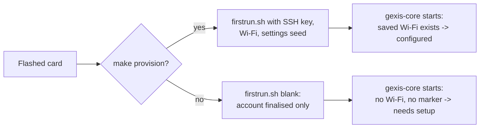
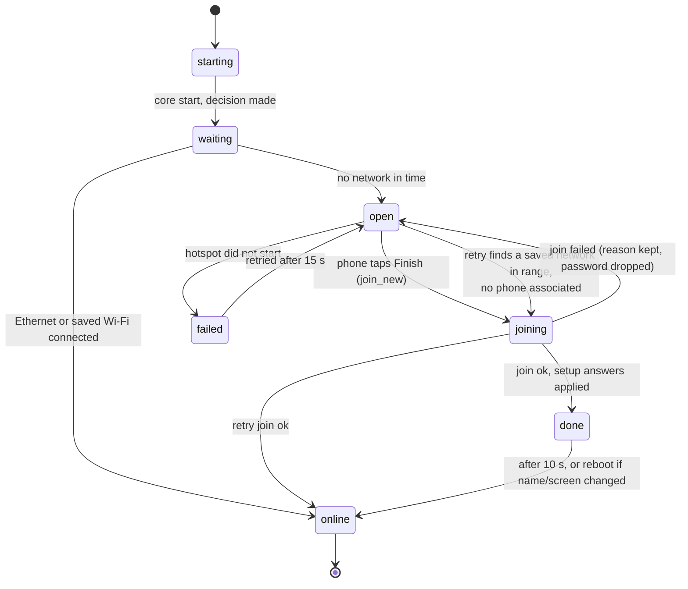
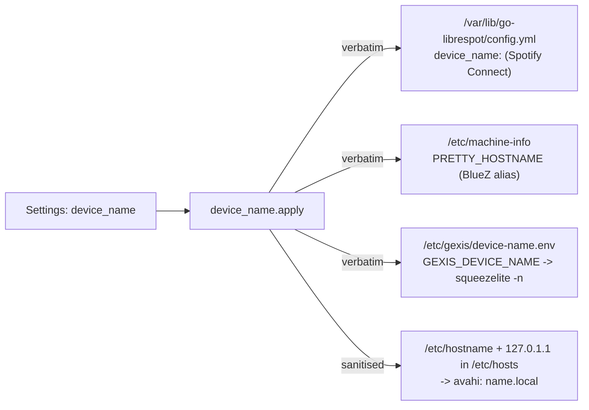

# Setup and network

How a freshly flashed card becomes a player on someone's network: the one-shot
first-boot script, the core's decision whether setup is needed, the setup
access point the phone joins, and how the answers are applied. Also how the
device's one name reaches the services that advertise it, and how Wi-Fi is
changed afterwards.

Decisions: ADR-0031 (setup access point, amended 2026-09-28), ADR-0104 (how the
device knows it needs setup), ADR-0048 (the device name), ADR-0109 (the Screen
step), ADR-0111 (the Visualiser step), ADR-0083 (backup and restore).

Code: `core/src/gexis_core/setup_network.py`, `setup_flow.py`, `wifi.py`,
`device_name.py`, `discovery.py`; UI `ui/src/screens/SetupPage.svelte` (phone)
and `SetupScreen.svelte` (panel); image `image/stage-gexis/01-firstboot/`.

---

## 1. First boot: `firstrun.sh`

The image has no cloud-init and no interactive wizard. Stage
`image/stage-gexis/01-firstboot/00-run.sh` installs `firstrun.sh` on the boot
partition and appends `systemd.run=/boot/firstrun.sh ... systemd.unit=kernel-command-line.target`
to `cmdline.txt`, so the script runs once, very early, then reboots. The
stage fails the build if the script is missing, if `cmdline.txt` does not call
it, or if stale cloud-init templates are present.

`firstrun.sh` calls the same platform helpers Raspberry Pi Imager's generated
script calls (`imager_custom`, `userconf`), each only if its variable is set:

| Variable | Effect |
|---|---|
| `SSH_PUBKEY` | enables SSH with that key (the image is key-only) |
| `WIFI_SSID` / `WIFI_PASS` / `WIFI_COUNTRY` | saves a NetworkManager connection named `preconfigured` and sets the country |
| `HOSTNAME`, `TIMEZONE` | as named |
| `IDLE_URL` | appended to `/etc/gexis/core.toml` |
| `SETTINGS` | JSON written to `/etc/gexis/settings-seed.json`; the settings registry treats it as defaults, so later changes still win |

`userconf pi ""` always runs: it finalises the `pi` account and cancels the
stock first-boot wizard. The script then deletes itself and its `cmdline.txt`
entry. `01-run.sh` ships `/etc/sudoers.d/010_pi-nopasswd`, asserted mode 440
and `visudo`-checked at build time, because nothing in this boot path would
otherwise create it.

**On a user's card every variable is blank** except `WIFI_COUNTRY`, which is
used only when `WIFI_SSID` is set; so first boot only finalises the account, and the core's setup flow (below) does the rest.

**On a developer's card**, `make provision DEVICE=/dev/sdX` runs
`image/provision.sh`: it mounts the flashed card's boot partition, rewrites
`firstrun.sh`'s variable lines from `image/provision.local.env` (single-quoted,
so a password containing `$(...)` is data, not code), parses each line back to
verify the round trip, and clears stale SSH host keys for the hostname. It
refuses an empty `SSH_PUBKEY` and invalid `SETTINGS` JSON. A card provisioned
with Wi-Fi has a saved connection, so it **never sees setup** (ADR-0104 §2).



---

## 2. Two questions, kept apart (ADR-0104 §1)

`SetupNetwork._run()` decides once, at core start:

- **Does the device need setup?** `needs_setup()` is true when NetworkManager
  holds no saved Wi-Fi connection (other than the setup profile itself) **and**
  `/var/lib/gexis/setup-done` does not exist. Either one means someone already
  configured it. Finishing setup writes the marker, so a device set up on
  Ethernet only does not ask again.
- **Does it need the setup network?** A fact about the radio now. A configured
  device that cannot reach its Wi-Fi needs the network but not setup; a new
  device on Ethernet needs setup but not the network.

`_wait_for_network()` then waits for NetworkManager to report an Ethernet or
Wi-Fi device `connected`:

| Device | Waits | Then |
|---|---|---|
| Needs setup, no Ethernet carrier (read from `/sys/class/net/*/carrier`) | 15 s | opens the setup network |
| Needs setup, cable has link | up to 90 s for an address | Ethernet: setup served over the LAN, no setup network (ADR-0031 amendment 8) |
| Configured | up to 90 s | online: nothing; otherwise opens the setup network |

The setup network **never opens while Ethernet has an address**, and it is
decided **at boot only**: a running device that loses its Wi-Fi stays as it is
until restarted (ADR-0104, answer 3).

A test hook: `/run/gexis-setup-trial` present at start opens the setup network
on a configured device regardless; it is read once and deleted, and a
`retry=<seconds>` line shortens the retry.

---

## 3. The setup network



State strings are the ones `SetupNetwork.status()` publishes:
`starting`, `waiting`, `open`, `joining`, `failed`, `done`, `online`.

**Opening** (`SetupNetwork.open()`), in order:

1. `rfkill unblock wifi` and `nmcli radio wifi on`. A blank card's radio is
   blocked: Raspberry Pi OS starts with `rfkill.default_state=0`, and pi-gen
   ships NetworkManager with wireless disabled when the build sets no country.
   The image deliberately has no default country (world regulatory domain).
2. Wait up to 20 s for NetworkManager to call `wlan0` usable (unblocking is
   not the chip being ready).
3. `nmcli device wifi hotspot` with profile and SSID `gexis-setup`, WPA2,
   **pinned to 2.4 GHz** (`band bg`) so nothing radiates on 5 GHz before a
   country is known. NetworkManager's shared mode serves DHCP and DNS
   (its own dnsmasq) on a private subnet.
4. `connection.autoconnect no`, read back: a profile left by a crash must never
   come up at boot in place of the home Wi-Fi. Any leftover profile is deleted
   at start.

**The password**: with a panel attached (an `HDMI-A-*` connector reporting
`connected`) *and* a screen already confirmed on it (ADR-0109 decision 5), eight
characters from an alphabet without `0 o 1 l`, made once and kept in
`/var/lib/gexis/setup-password` (0600) so it survives reboots. Otherwise a
fixed, documented password, since nothing can show a made-up one.

**No captive portal** (ADR-0031 amendment 2). The panel shows two QR codes in
sequence: one that joins the network, then one for the page,
`http://<setup address>:8090/`. The panel's copy tells the user to turn mobile
data off, because the setup network has no internet and phones otherwise send
the request over mobile data.

**Following the phone**: every 2 s while open, `iw dev wlan0 station dump`
MACs are intersected with unexpired dnsmasq leases. Association alone fired
before the phone could reach the page; a lease is the step after which it can.
The page's first `GET /setup/answers` marks `page_opened`. The panel
(`SetupScreen.svelte`) walks *join -> joined -> page -> phone -> joining* from
these, and takes no input (ADR-0029).

**Retry** (`_hold()`): every 5 minutes, *only if no phone is associated*, scan
while hosting; if a saved network is in range, take the setup network down and
join it, reopening it if the join fails. A failed hotspot start is retried
every 15 s instead.

---

## 4. The phone-driven flow

One radio means the phone loses the page the moment the device leaves the
setup network, so **the core holds the answers, not the page** (ADR-0104 §4).
Each step's Continue saves to `/var/lib/gexis/setup-answers.json`, written
atomically and 0600 from the first byte (it holds the Wi-Fi password). A page
that reloads resumes from it; the password is never handed back, only
`has_password`.

The phone's steps (`SetupPage.svelte`): Network, Name, Time (zone and 12/24 h),
Output, Music, Screen, Visualiser (skipped for headless or for screens no skin
pack fits), Plugins (ADR-0128; every plugin the release ships beyond the
built-in sources, from `GET /setup/plugins`; skipped when there are none),
Review.

```mermaid
sequenceDiagram
  autonumber
  participant P as Panel (SetupScreen)
  participant Ph as Phone (SetupPage)
  participant C as gexis-core
  participant NM as NetworkManager

  C->>NM: hotspot gexis-setup (WPA2, 2.4 GHz)
  P->>C: GET /setup/status (loopback: includes password)
  P-->>Ph: QR code: join the network
  Ph->>NM: associate, DHCP lease
  C->>C: station dump ∩ leases -> phones=1
  P-->>Ph: QR code: open the page
  Ph->>C: GET /setup/answers (page_opened)
  Ph->>C: GET /setup/networks (scan while hosting)
  loop each step
    Ph->>C: POST /setup/answers {step fields}
    C->>C: validate, save setup-answers.json
  end
  Ph->>C: POST /setup/finish
  C-->>Ph: 202 {"finishing": true, "keep_question": ...}
  Note over C: _apply(): settings first, via Settings.set
  C->>C: Wi-Fi country from time zone (raspi-config)
  C->>C: wait 3 s so the phone's last screen arrives
  C->>NM: take the setup network down
  C->>NM: add profile for chosen SSID, connection up
  alt join succeeds
    C->>C: touch setup-done, delete answers file
    C->>C: Lyrion: find / given address / off
    C->>C: plugins on or off as chosen; settling.json (ADR-0128)
    C-->>P: state done (network, library, restart reason)
    C->>C: after 10 s: reboot if a screen was chosen or the name differs from the old one, else online
  else join fails
    C->>NM: delete the profile just made
    C->>C: drop password, keep other answers + error, step=wifi
    C->>NM: reopen the setup network
    Ph->>C: (rejoins) page opens on Network with the reason
  end
```

**Applying** (`SetupFlow._apply()`):

1. **Settings first**, each through `Settings.set` so it does exactly what it
   does from Settings: `device_name`, `timezone`, `clock_format`,
   `output_device`, `lms_server` (only when "Enter an address" was chosen),
   `spotify_enabled`, `bt_enabled`, `headless`, `screen`, `visualiser_skins`.
   One refusing setting is logged and the rest go on; nothing strands the
   device on the setup network.
2. **Wi-Fi country** from the time zone via tzdata's `zone.tab` (not
   `zone1970.tab`, which lists several countries per zone), applied with
   `raspi-config nonint do_wifi_country`, which lifts the radio block for good.
3. **The network, last**, because it is the step that loses the page.
   `join_new()` replaces only a profile named after the network; a failed join
   deletes what it saved, since NetworkManager would otherwise retry a wrong
   password forever.
4. On success: write `setup-done`, delete the answers, then **Lyrion**. Over the
   setup network there is nothing to discover, so the Music step's *Find* mode
   runs after the join: `discovery.find_servers()` broadcasts Lyrion's UDP
   discovery datagram on port 3483 and takes each reply's source address.
   Exactly one server is used; several are named and left to Settings; *Off*
   sets `lms_enabled` false.
5. The panel shows the result for 10 s, then the device **reboots** if any
   screen was chosen in setup, or if the name differs from the old one (both
   apply at a restart; the Screen step's restart is where *Keep this screen?*
   is asked, ADR-0109), otherwise goes `online`.

**Setup's own screens are laid out for the attached screen** (ADR-0109
amended 2026-10-07): `gexis-screen-check` runs before the kiosk during setup
too and applies the recognised model, the one listed bar of its mode
(restarting first for a bar's kernel mode), or the screen's own mode, scale
only. The choice is **provisional** in `screen.json`: no Keep is asked, and
`screen_apply.confirmed()` stays false, so the setup network keeps the fixed
password. The Screen step confirms it, or replaces it and asks Keep.

**Errors** reach the phone as sentences (`setup_flow.said()`); the core's own
text goes to the log.

### Routes

All under the core's HTTP server on port 8090 (`wsserver.py`):

| Route | Purpose |
|---|---|
| `GET /setup/status` | state; the **password only to a loopback caller** (the panel). Phones and the `/state` broadcast get `public_status()` without it |
| `GET/POST /setup/answers` | read (resume) / save one step |
| `GET /setup/networks` | Wi-Fi scan, the setup network itself removed |
| `GET /setup/screen` | the Screen step: what the screen reports, the suggested model, all models |
| `POST /setup/finish` | start applying; answers `202` with `{"finishing": true, "keep_question": ...}` |
| `GET /setup/plugins` | ADR-0128: the plugins the Plugins step offers - `id`, `name`, `summary`, `notice`, `from`, `component` |

Every route but `/setup/status` answers 409 once setup is over (`_setup_closed`):
a configured device has Settings for all of this. On a phone, `App.svelte`
renders `SetupPage` in place of Settings while setup is needed or the setup
network is up; on the panel, `SetupScreen` covers the ordinary screens.

---

## 5. The device name (ADR-0048)

There is one `device_name` setting and no per-service override (ADR-0022).
`device_name.apply()` writes it to four places, and **none takes effect until
the next restart**: changing the hostname under a phone is how that phone
loses its way back, and applying some targets live would leave the device
advertising two names.



- The hostname takes a sanitised form: accents folded, lowercase, anything
  outside `[a-z0-9-]` becomes `-`, capped at 63; an empty result falls back to
  `gexis`. avahi publishes it as `<hostname>.local` (e.g. `gexis.local`).
- BlueZ's name comes from `PRETTY_HOSTNAME`, not `main.conf`'s `Name =`, which
  the hostname plugin overrides.
- `/etc/hosts` carries both old and new names between a rename and its restart,
  so the running hostname still resolves.
- The core finds its own LMS player by the name squeezelite announces, read
  from `device-name.env` at start (`lms_player()`), so the two cannot disagree.
- Each target is attempted; the result names any that failed.
- A restore (ADR-0083) carries `device-name.env` but not the hostname or
  `machine-info`, so `apply_restored()` re-applies the restored name to all four
  before the restore's reboot.

---

## 6. Wi-Fi after setup

Settings' Wi-Fi row is a `list` row (ADR-0044) backed by `wifi.py`, through
`nmcli` (the core runs as root, so there is no polkit or secret-agent dance):

- `GET /settings/wifi/items`: a scan, with signal bars and which networks are
  saved. `saved_ssids()` maps SSID to connection by reading each profile's
  SSID, because profiles are not named after networks (the provisioned one is
  called `preconfigured`).
- `POST /settings/wifi/items` with `join` (optional password) or `forget`.
  A refused password is a 200 with the reason, so the sheet can offer a retry.
- The connected SSID is refreshed in the background every 20 s; it was once
  read on the request path and blocked the daemon for seconds.
- Nothing changes the connection the daemon is reached over without an explicit
  per-item action. A device that loses its Wi-Fi recovers by restarting, which
  re-runs the boot decision in §2.

## 7. Bluetooth pairing, briefly

Pairing is confirmed on the panel on a device's first pair only (ADR-0045,
reversing ADR-0024). `bluetooth_agent.py` registers the core's own BlueZ
`Agent1` with capability `DisplayYesNo` by default, which makes BlueZ produce a
six-digit code (`RequestConfirmation`) to show on the panel and match on the
phone; a "PIN-free" pairing setting registers `NoInputNoOutput` instead
(`capability_for()`). The
agent's timeout is the only clock: the panel's countdown displays it, and the
prompt disappears when the agent says so.

## The first start after setup (ADR-0128)

After the join, `SetupFlow._plugins_and_settling` switches every offered
plugin on or off as chosen - explicitly, since a plugin switch defaults to on -
and records in `/var/lib/gexis/settling.json` what the first start waits for:
the visualiser's skins (component `skins`) when chosen, and each chosen plugin
that downloads (its component name). Nothing to wait for writes nothing.

The core reads it every 2 s (`_follow_settling`) against `_all_components()`
and publishes `settling` on `/state` (`settling.view`): each item `waiting`,
`busy` (with `received`/`total`), `done` or `failed` (with `error`), and the
phase `settling`, `ready` or `failed`. An item still waiting 10 minutes after
setup (`WAIT_S`; no home network, most likely) is failed with *The download
did not start*. `ready` stays up 4 s (`READY_S`), then the file is removed;
`failed` stays until `POST /settling/done`. The panel draws
`SettlingScreen.svelte` over everything but *Keep this screen?* and the update
lock, with no way to dismiss it while anything downloads; a phone draws it too.
