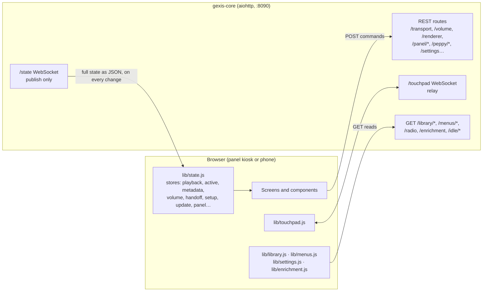
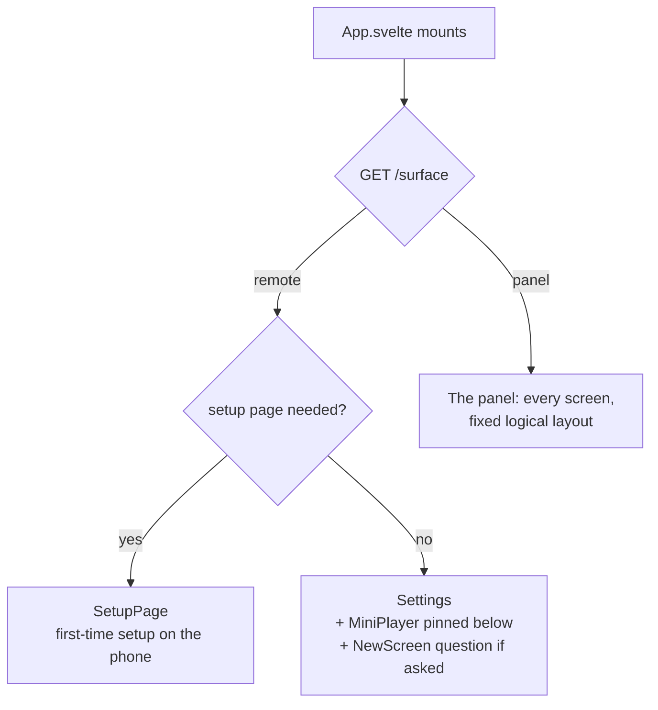
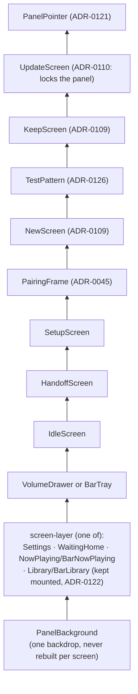
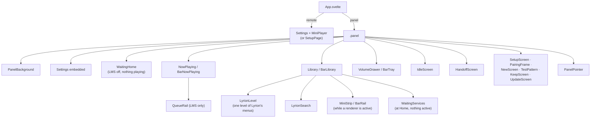
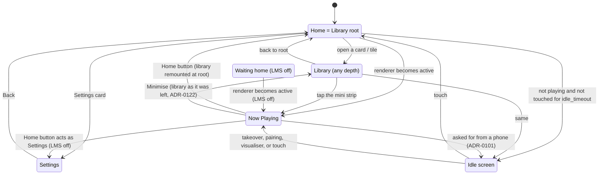
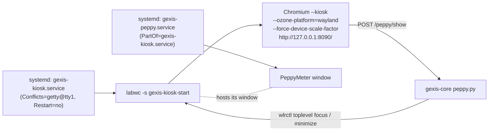

# The UI

The panel's screens and the phone's page are one Svelte 5 application under
`ui/`. `gexis-core` serves it and keeps its state current, and it sends
commands back to the core. This document covers how the app is built and
served, how it chooses what to draw, and how the phone drives the panel.

Related records: ADR-0023 (Svelte), ADR-0028 (the core serves the UI;
commands over REST), ADR-0032 (one page, two surfaces), ADR-0101 (the
phone's mini player), ADR-0109 (screen families), ADR-0121 (the phone as
touchpad).

---

## 1. Build and delivery

| Piece | Where | Notes |
|---|---|---|
| Source | `ui/src/` | Svelte 5 (runes), Vite 8, target `es2022` |
| Entry | `ui/src/main.js` | Imports the bundled fonts and `styles/tokens.css`, then mounts `App.svelte` on `#app` |
| Build | `npm run build` (`make ui`) | `vite build`, then `scripts/licenses.mjs` writes the licences of bundled code |
| Output | `ui/dist/` | `index.html` plus hashed files under `assets/` |
| Package | `packaging/ui/build.sh` | Packs `ui/dist` into `gexis-ui` at `/opt/gexis-ui` (ADR-0107) |
| Served by | `core/src/gexis_core/wsserver.py` | `/`, `/assets/*`, and the few named app files a phone reads to install Settings as an app (ADR-0102) |

Node never runs on the device. The image ships only the static output
(ADR-0023). The fonts are bundled because the panel may have no internet.

Vite writes everything into `assets/` so the daemon needs only two static
routes. The UI routes are registered **after** the API routes. aiohttp
matches routes in the order they were registered, so a static path can never
shadow `/state` or a command.

`npm run dev` serves the UI from Vite and proxies to a running core
(`GEXIS_CORE`, default `http://gexis.local:8090`). See the disagreements at
the end: the proxy list is incomplete.

---

## 2. Talking to the core



- **State comes in one way.** `lib/state.js` is the only module that opens
  `/state`. Every frame is the whole `PlaybackState` as JSON
  (`state.to_json()` in the core). The module exposes derived stores
  (`active`, `metadata`, `volume`, `capabilities`, `available`, `queue`,
  `handoff`, `pairing`, `panel`, `setup`, `update`, `screenConfirm`,
  `screenNew`, `screenCheck`, `sources`, …). Components subscribe to these stores and
  never read the socket. Reconnects back off from 0.5 s to 5 s, because the
  kiosk has to outlive any number of core restarts.
- **Commands go over REST, never the socket** (ADR-0028). `post()` in
  `state.js` raises the server's own `error` text, which lets messages such
  as "LMS unreachable" reach the user. A command's result is not taken from
  its response: it comes back on `/state`. For example, a play/pause button
  shows what the renderer reports, not what was pressed (ADR-0037).
- **Reads go over GET.** Library data comes from `/library/...` (typed LMS
  queries the core runs, ADR-0038), from `/menus/...` (Lyrion's own menus,
  addressed by handles the core issued, ADR-0118) and from `/radio`. Cover
  URLs point straight at LMS (ADR-0020).
- **Settings** are loaded from `/settings` (ADR-0035) and loaded again
  whenever `settings_revision` changes in the state. A change made on the
  phone therefore reaches the panel.

---

## 3. One bundle, two surfaces

The same `index.html` is served to everyone. On mount, `App.svelte` asks
`GET /surface`. The core answers `panel` when the request comes from loopback
(the kiosk loads `http://127.0.0.1:8090/`) and `remote` for anything else.
If the request fails, the app assumes `panel`.



- **Panel**: renders everything. The panel reports touches (`/touch`,
  throttled to one a second), its first painted frame (`/panel/painted`, which
  ends the boot animation, ADR-0043), and what it shows (`/panel/shown`).
  Only the panel reports touches, so that a tap on a phone does not count as
  attention and take the visualiser down (ADR-0036).
- **Remote (phone)**: Settings, which is the only responsive screen
  (ADR-0032), plus the mini player (ADR-0101). During setup it shows
  `SetupPage` instead (ADR-0104). The first-boot flow is covered in
  `setup-and-network.md`.

---

## 4. Screen families and sizes

The layout is designed at a fixed logical size and scaled to the screen.
Chromium's device scale factor does the scaling (ADR-0109).

| Family | Aspect (width/height) | Logical size | Scale factor |
|---|---|---|---|
| **Standard** | about 1.5–1.8 | 1280 wide; height is what the screen leaves (800 on the 1280x800 panel) | screen width ÷ 1280 |
| **Bar** | about 3–5 | 400 tall; width is what the screen leaves (1280 on 1280x400, 1850 on 1480x320) | screen height ÷ 400 |

How a screen gets its scale:

1. When a screen is chosen, the core writes `/etc/gexis/screen.env`
   (`core/src/gexis_core/screen_apply.py: env_for`): `GEXIS_SCREEN_FAMILY`,
   `GEXIS_SCREEN_SCALE`, `GEXIS_SCREEN_TRANSFORM` and the connector. The
   known screens come from `screens_data/display_presets.json` and
   `screens.py`.
2. `gexis-kiosk-start` rotates the output with `wlr-randr` (bar panels are
   portrait panels used sideways) and starts Chromium with
   `--force-device-scale-factor`.
3. In the page, `ui/src/lib/family.svelte.js` derives the family from the
   viewport alone: `width / height >= 2.4` is `bar`, anything else is
   `standard`. It recomputes on resize.

`App.svelte` then mounts the matching component for each role:

| Role | Standard | Bar |
|---|---|---|
| Now Playing | `screens/NowPlaying.svelte` | `screens/bar/BarNowPlaying.svelte` |
| Library | `screens/Library.svelte` | `screens/bar/BarLibrary.svelte` |
| Mini player inside the library | `screens/MiniStrip.svelte` (bottom strip) | `screens/bar/BarRail.svelte` (124 px rail on the right) |
| Volume / Home / visualiser controls | `screens/VolumeDrawer.svelte` plus Now Playing's buttons | `screens/bar/BarTray.svelte` (pull-down tray over every screen) |

Each bar component takes the same props as its Standard counterpart and keeps
the same data and actions. Only the drawing differs. A bar drops some content
by design: the biography, Popular, similar artists, tags, and the Artist and
Release tabs (ADR-0109 decision 7). Lists run sideways on a bar
(`bar/sideways.svelte.js`). `bar/JumpStrip.svelte` is the letter-pair jump
strip; Artists and Lyrion's lettered lists share it.

---

## 5. The panel's layer stack

Exactly one screen is drawn at a time, over one shared backdrop
(`PanelBackground.svelte`: the design's weave plus the blurred artwork).
Screens are transparent, and changing screen has no animation. The overlays
sit above the screen in a fixed z-order:



Component tree, as `App.svelte` mounts it:



---

## 6. Which screen shows: navigation

`App.svelte` is the router. There is no URL routing; the screen follows from a
few values:

- `$active`: the renderer holding the device, or `null` (ADR-0027 makes "no
  renderer" a routine state).
- `lms_enabled`: the *setting*, not LMS's reachability. With LMS off the panel
  has no library and is two screens (ADR-0079).
- `libraryRequested`: set by Home or Minimise, cleared by the mini strip.
- `settingsOpen`, `idle`.

Home *is* the library's root (ADR-0033): it is the screen shown when nothing
is connected. When a renderer arrives, Now Playing shows.



Details worth knowing:

- **Minimise vs Home (ADR-0122).** The library stays *mounted* while Now
  Playing is up (`.is-kept` uses `content-visibility: hidden`, which keeps
  scroll positions). Minimise reveals it as it was left. Home remounts it at
  the root (`{#key libraryHome}`).
- **Idle (ADR-0033)** means "not playing and not touched" for
  `idle_timeout` minutes (default 5). `?idle_seconds=` overrides it for
  testing. The panel wakes from idle on a takeover, a pairing request, the
  visualiser being raised, or the end of setup. All of these also count as a
  touch, so the panel does not drop straight back to idle. The idle screen is
  suppressed while setup is shown.
- **Handoff (ADR-0094).** When `$handoff` appears, `HandoffScreen` shows for
  at least `handoff_duration` seconds (default 1.5), or for as long as the
  takeover lasts if that is longer. The `show_transition` setting turns it
  off.
- **The phone can steer the panel.** It asks for `home`, `now`, `lyrics`,
  `track` or `minimise` (`POST /panel/go/{to}`), and for the idle screen to
  be shown or hidden (`POST /panel/idle/{show|hide}`). The asks come back to
  the panel in `panel.view_request` / `panel.idle_request`. Each ask is
  numbered, applied once, and ignored if it is older than 60 s, so a panel
  that reloads does not replay it.

### Library structure

`Library.svelte` holds the navigation path (`path`, with `here.kind` in
`artists`, `artist`, `album`, `browse`, `playlists`, `playlist`, `radio`,
`menu`, `menusearch`), the header and the footer. The region between them is
drawn per kind:

- **Typed screens** (Artists grid, artist page, album, Browse, playlists)
  read `/library/...` (ADR-0038). Long lists build only what is on screen
  (ADR-0065, ADR-0067). The artist grid builds by letter group, with spacers
  standing in for the groups not on screen.
- **Radio** uses the core's SlimBrowse walker (ADR-0030, ADR-0038 §5).
- **Lyrion's own menus** (My Music, Favourites, Apps) are added by the
  *Extended navigation* setting (`lms_extended_nav`, default off; ADR-0118).
  `LyrionLevel.svelte` draws one level. "What an entry opens decides its
  shape": branches become tinted-disc tiles, albums and playlists a cover
  grid, and tracks and stations leaf rows. A leaf row reveals Play / Play
  next / Add on the first tap. `LyrionSearch.svelte` runs a search entry's
  searches as typing pauses. The panel only ever holds *handles* the core
  issued (`lib/menus.js`), never Lyrion commands. Each list's list/tiles
  choice is kept in `localStorage`.
- **Footer**: `MiniStrip` while something is active. At Home with nothing
  active, `WaitingServices` shows the waiting renderers' marks instead.

The root's data is loaded once at start-up, and its covers are decoded
before it is shown, so that Home appears complete (`lib/library.js`).

### Now Playing structure

`NowPlaying.svelte` has the cover, the transport, and four tabs: **Track,
Lyrics, Artist, Release**. A bar shows Track and Lyrics only. Which controls
appear comes from `capabilities[active].controls`; whether each works right
now comes from `controls.available` (ADR-0037). The `QueueRail` slides in for
LMS only, the one renderer with a queue (ADR-0038 §1). Removing a row is a
swipe (ADR-0062), and rows are keyed by track identity (ADR-0064). Artwork
and artist text that is not on the track's own record comes from enrichment
(`lib/enrichment.js`), held at module level so the mini strip sees the same
answer. Enrichment only adds; it never overwrites what the renderer supplied
(ADR-0012).

### Idle screen

`IdleScreen.svelte` (ADR-0033, ADR-0047) shows a drifting clock and date and
a weather band (3 days or today only). The background is one of *Gexis
wallpapers*, *Space pictures*, *Artist pictures*, *Wallpapers online*,
*Wallpapers on device* or *Black* (`idle_background`). The first two are the
player's own pictures (ADR-0133): `gexis-wallpapers` installs them at
`/usr/share/gexis/wallpapers/<set>/` with `credits.json`, served at
`/idle/wallpaper/own/<set>/<file>` for names in that list only.
`own_wallpapers.active_sets` chooses the sets a picture may come from - a
holiday's alone on its days (`holiday()`: New Year; Christmas and Easter,
Western or Orthodox, by country), otherwise the chosen styles plus the
hour's and the season's - and `_where()` in `wsserver.py` takes the country
and latitude from the weather location's geocoding, or from `zone.tab` for
the time zone. *Artist pictures* fall back to them while `lms_enabled` is
off. *Space pictures* come first from `space_pictures.SpacePictures`: a
catalogue refreshed at most daily, in the background, from ESA/Webb's and
ESA/Hubble's feeds (kept when the picture page's credit starts with "ESA",
CC BY 4.0) and two of `NASA_QUERIES` against `images-api.nasa.gov` (a NASA
centre, no partner in the credit, a scene and no people); each picture is
fetched when first shown into `/var/lib/gexis-core/space/` (ESA's 1920-px
wallpaper, NASA's large preview), the newest 40 kept, and served at
`/idle/wallpaper/space/<file>`. Offline it shows what it kept and asks again
after an hour; with nothing kept, the built-in `space` set shows. A migration keeps *Artist pictures* on a player already in use, the
old default. It can also show an external page if the
`idle_screen` setting chooses one and the page is embeddable. It reads
`/idle`, `/idle/weather` and `/idle/wallpaper?w=&h=`. The source credits are
drawn on screen because the data licences ask for them. Legibility comes
from a contour on the glyphs, not from a plate behind them (ADR-0041 bans
live backdrop blur).

---

## 7. The phone page

On a phone, `Settings.svelte` fills the page and `MiniPlayer.svelte` is
pinned below it (ADR-0101). The mini player provides:

- what is playing and from which source;
- the volume (`POST /volume`), shown as a padlock in fixed output (ADR-0046);
- toggles that act on the panel: the visualiser (`/peppy/show|hide`), the
  idle screen, and Home / Now playing / Lyrics. Each toggle reflects what the
  panel reports it is showing (`panel.visualiser`, `panel.idle`,
  `panel.now`, `panel.lyrics`);
- when its sheet is open, a **touchpad** (ADR-0121).

### Touchpad relay

The phone moves a pointer that the panel draws itself
(`lib/PanelPointer.svelte`); the compositor's cursor is a blank theme. Both
sides use one WebSocket, `/touchpad`. The core relays messages and never
interprets them:

- It tells the two ends apart by loopback (the panel) or LAN (a phone).
- It accepts only `move`, `tap`, `text`, `key`, `scroll`, `zoom` from phones
  and `over`, `focus` from the panel.
- It drops messages over 2 KB, and drops everything while the
  `phone_touchpad` setting is off.
- When a phone disconnects, it tells the panels `gone`, and the panels zoom
  back out.

`/state` stays publish-only (ADR-0028).

```mermaid
sequenceDiagram
  participant Ph as Phone (MiniPlayer)
  participant C as gexis-core /touchpad
  participant P as Panel (PanelPointer)

  Ph->>C: open /touchpad (sheet opened)
  P->>C: open /touchpad (phone_touchpad on)
  Ph->>C: {"t":"move","dx":..,"dy":..}
  C->>P: relayed as-is
  Note over P: moves summed per frame,<br/>bursts spread over frames;<br/>hover events synthesised
  P->>C: {"t":"over","field":true}
  C->>Ph: relayed - pointer is over a text field
  Ph->>C: {"t":"tap"}
  C->>P: relayed
  Note over P: pointerdown/mouseup/click dispatched<br/>at the pointer; field focused
  Note over Ph: same touch opens the phone keyboard<br/>(the only moment a browser allows it)
  P->>C: {"t":"focus","field":true}
  C->>Ph: relayed
  Ph->>C: {"t":"text","text":"abc"} / {"t":"key","key":"Backspace"}
  C->>P: relayed - inserted into the focused field
  Ph--xC: sheet closed / phone gone
  C->>P: {"t":"gone","phones":0}
  Note over P: unzoom, hide pointer
```

- **Moves are relative**, like a laptop touchpad, and scaled by the
  *Pointer speed* setting, so a bar and a 16:9 panel feel the same. The
  pointer hides after 5 s without input.
- **Taps** dispatch real pointer and mouse events at
  `document.elementFromPoint`, then focus the field if one is there.
- **Two fingers** either scroll (the scroll is applied smoothly over several
  frames) or pinch-zoom the panel up to 3x.
- **Typing** is inserted as `InputEvent`s into the focused field, so any
  character works. There is no on-screen keyboard (ADR-0029).
- **Reconnect**: `lib/touchpad.js` opens a fresh socket on
  `visibilitychange`, `pageshow` and `online`. A phone browser that was in
  the background can lose its socket without the page ever being told.

---

## 8. The kiosk, and the Peppy screen beside it



- `image/stage-gexis/04-ui/files/gexis-kiosk.service` starts labwc on tty1
  with a logind seat. The service runs `gexis-splash-fb handover` first, so
  the boot picture carries over to labwc without a black frame (ADR-0043).
  labwc's session script is `gexis-kiosk-start`. When the script exits,
  labwc exits, so Chromium is never left running as an orphan.
- `gexis-kiosk-start` reads `/etc/gexis/kiosk.env` (the URL and profile
  directory) and `/etc/gexis/screen.env` (§4). It sets a `swaybg` wallpaper
  to cover the gap before the first paint. It removes Chromium's profile
  lock, which goes stale after a hostname change, then runs Chromium with
  kiosk flags. Each flag is justified in the script, for example
  `--disable-lcd-text` (ADR-0061), `--disable-pinch` and
  `--overscroll-history-navigation=0`.
- `labwc-rc.xml` is deliberately almost empty: no decorations, no
  keybindings, and touch mapped to the panel's output.
- **The Peppy screen is not part of this app** (ADR-0014, ADR-0026).
  PeppyMeter is a separate native window under the same compositor. The UI
  only asks for it (`POST /peppy/show`, `/peppy/hide`). `core/.../peppy.py`
  raises or minimises that window through `wlrctl` (matching
  `title:pygame window`). The meter process keeps running while hidden but
  **does not draw** (ADR-0019 as amended 2026-10-07, Finding 112): the core
  writes `/run/gexis/visualiser-shown` (`0` hidden, `1` before a show), the
  driver skips its own drawing and slows to five frames a second while it
  reads `0`, and the core waits 0.25 s after writing `1` before raising the
  window, so the first frame shown is finished. Hidden while music plays it
  takes about 6 % of a core instead of 57 %. The core also raises it after five
  minutes of unattended playback (ADR-0036). Its visibility is published as
  `panel.visualiser`, and the UI clears the idle screen when it goes up.
  While an update runs, the panel hides it.

---

## 9. Other full-screen states

| Screen | When | Notes |
|---|---|---|
| `HandoffScreen` | `$handoff` set | From → to, minimum length a setting (ADR-0094) |
| `PairingFrame` | `$pairing` set | Bluetooth first-pair confirmation. The agent dismisses it, not the frame's own countdown (ADR-0045) |
| `SetupScreen` (panel) | setup network up, or the device needs setup | Shows QR codes and the way in. Takes no input. Readable from 2 m (ADR-0104 §5). The password comes from loopback-only `/setup/status`, never from `/state` |
| `SetupPage` (phone) | the device needs setup | The first-time setup flow; answers are saved step by step to the core |
| `NewScreen` / `KeepScreen` | a different screen is attached / a new screen awaits confirmation | Only the panel answers Keep; a countdown reverts (ADR-0109 decision 5) |
| `TestPattern` (panel) | `screen_check` showing | The hardware feedback's test pattern; the panel's four corner taps go back to the core. Mounted over everything but *Keep this screen?* and the update lock (ADR-0126) |
| `UpdateModal` (Settings) | the user checks for an update | One modal, from the check to the outcome (ADR-0110 §3) |
| `UpdateScreen` (panel) | `update.active` | Locks the panel and stays up through the core restart and reconnect. At the end it waits for Done, or 10 min. It reloads the page if the installed release changed (ADR-0110 §6). Separately, the panel reads its own `index.html` once a minute and reloads when the UI build it names differs from the one running, unless the update lock, setup, *Keep this screen?* or the test pattern is up (ADR-0110 as amended 2026-10-09) |

---

## Where code and docs disagree (code wins)

None are known as of 2026-10-07.
