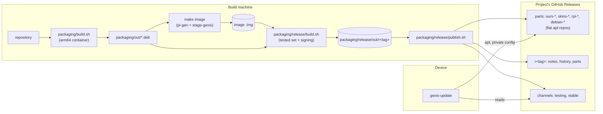
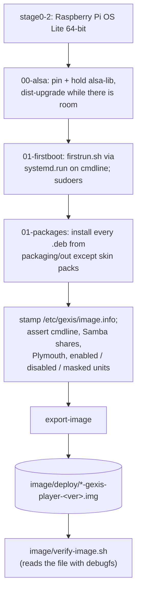
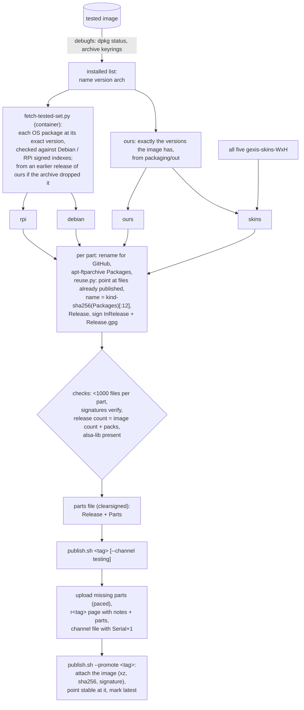
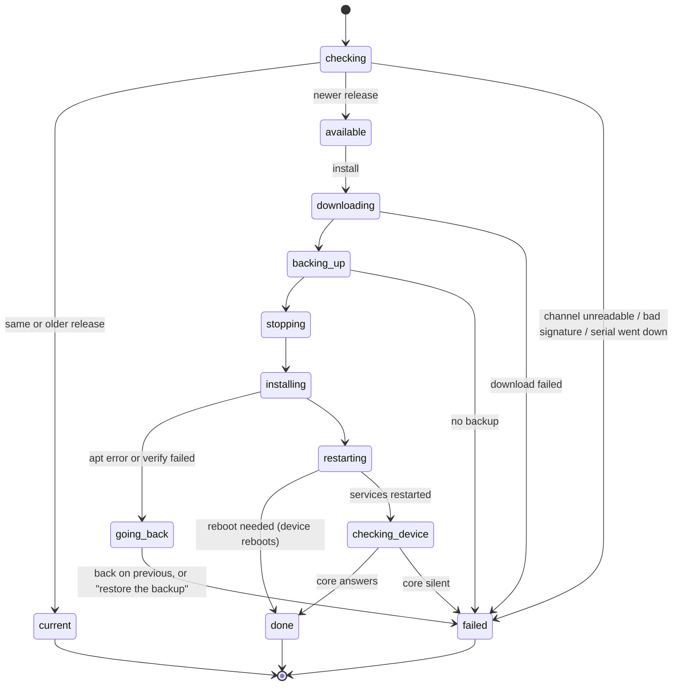

# Updates, releases and the image

How Gexis Player's software reaches a device: as Debian packages, built in a
container, published as signed apt repositories on the project's GitHub
Releases, found through a signed channel file, and installed by a standalone
updater that can put the previous release back. The flashable image is built
from the same packages.

Decisions: ADR-0021 (flashable image), ADR-0042 (download cache), ADR-0100
(fetched software), ADR-0105 (updates over the network), ADR-0106 (plugins),
ADR-0107 (packages), ADR-0108 (publishing), ADR-0110 (the update experience),
ADR-0111 / ADR-0113 (skin packs), ADR-0116 (change logs).

---

## 1. The big picture



Three ideas carry the design:

- **A release is exactly what was tested** (ADR-0105 §3). The release package
  `gexis-player` depends on exact versions of every one of our packages and of
  alsa-lib, and the release carries every OS package the tested image had, at
  that image's versions. An update moves a device onto that set, nothing newer.
- **Everything is signed by one release key** (the public half is
  `packaging/keys/gexis-release.asc`, shipped by `gexis-core` to
  `/usr/share/gexis/keys/`). The channel file, each part's `InRelease`, a
  release's `parts` file and its notes are all verified on the device with
  `gpgv` before being believed.
- **The updater outlives what it installs.** It is a standalone script on the
  system Python and standard library, run by its own systemd units, never by
  the core (an install restarts the core).

---

## 2. Our parts as Debian packages (ADR-0107)

`packaging/build.sh [package ...]` builds into `packaging/out/`, one
`packaging/<name>/build.sh` per package, each run inside the
`gexis-deb-builder` container (`packaging/builder.Dockerfile`, arm64 Debian
trixie under qemu; rebuilt when the Dockerfile's hash changes). `make packages`
builds the UI first (`npm ci && npm run build`) and then all packages.

| Package | Carries |
|---|---|
| `gexis-core` | the core in its own venv at `/opt/gexis-core/venv`, its units, built-in plugin manifests, **the updater** (`/usr/lib/gexis/gexis-update`) and its four units (`gexis-update-check.service`, `gexis-update-check.timer`, `gexis-update-checknow.service`, `gexis-update-install.service`), the release key |
| `gexis-ui` | the built Svelte pages |
| `gexis-system` | our units, ALSA files, kiosk, splash, Samba/Avahi files, the Peppy driver - built from `image/stage-gexis/*/files` |
| `gexis-peppyalsa`, `gexis-peppy-engines` | the meter tap library; PeppyMeter/PeppySpectrum |
| `gexis-go-librespot`, `gexis-beszel-agent` | upstream binaries, as built upstream (ADR-0093) |
| `gexis-beszel-hub`, `gexis-lyrion-server`, `gexis-plexamp` | plugins; Lyrion and Plexamp themselves are *not* inside (see §7) |
| `gexis-skins-<W>x<H>` | one visualiser skin pack per screen size (ADR-0111); never in the image. `gexis-update pack-install` fetches it at 3 MB/s (apt's `Dl-Limit`) while the player is in use - a card playing, or go-librespot, BlueALSA or BlueZ active in the last 10 min - and restarts apt at the other speed when that changes, resuming the partial file (ADR-0111 amended 2026-10-07) |
| `gexis-player` | **the release**: exact `Depends` on all of the above (skins excepted), on `libasound2t64`, and the OS packages the device runs |

**Versioning.** A package's version is the `git describe` of the *last commit
that changed its inputs* (`inputs()` in `packaging/build.sh`), rewritten as
`0.9.1+git42.ba6900a`. Third-party components carry upstream's version, plus
our commit when the package also carries our files. `gexis-player` is the
repository as a whole; a published release is built from a `v<x.y.z>` tag, so
its version is plain `x.y.z` (ADR-0110 §1). A dirty tree appends `.dirty`.

**Reproducible.** `SOURCE_DATE_EPOCH` is the commit time of the package's
inputs, so an unchanged package rebuilds byte-identical. That is what lets
publishing skip files already uploaded. Skin packs are additionally reused
from a local cache (`~/.cache/gexis-player/debs`) when their version is
unchanged.

**alsa-lib is pinned.** The image installs and holds
`libasound2t64=1.2.14-1+rpt1+deb13u1` (`image/stage-gexis/00-alsa`), and
`gexis-player` depends on that exact version, so apt cannot move it without
removing the release. The updater checks it again after installing.

---

## 3. The image (ADR-0021, ADR-0042)

`make image` = `packages` + `skins` (corpus validation) + `prune` +
`fresh-stage-gexis`, then pi-gen's own `build-docker.sh`, unmodified, with
`image/config` (stages 0-2 plus `stage-gexis`, no cloud-init, uncompressed
output). The repository's `image/stage-gexis`, `packaging/out` and the download
cache are bind-mounted in. Warm builds reuse the preserved `pigen_work`
container (`CONTINUE=1 PRESERVE_CONTAINER=1`); see `image/README.md` for host
prerequisites and disk housekeeping.



- Most `stage-gexis/NN-*/files` directories are no longer installed by the
  stage; they are inputs to `gexis-system` and friends. The stage scripts that
  remain install packages and **assert** the result, failing the build rather
  than a flashed card.
- **Vendored downloads** go through `image/stage-gexis/fetch-cached.sh`:
  `fetch_cached <url> <sha256> <dest>` looks in a content-addressed cache
  first (the file is named by its checksum), verifies on the way in and out,
  and works with no cache at all (ADR-0042).
- **`image/verify-image.sh `** checks the artefact before anyone flashes
  it: it reads the root partition with `debugfs` (no root, no loop device) and
  compares files byte for byte with the checkout - units, kiosk, Peppy driver,
  the venv against `core/src`, the UI against `ui/dist` - plus enabled units,
  no skin pack installed, plugins shipped off, licences present, and the ALSA
  default.
- **`image/provision.sh <device>`** (`make provision`) prepares a flashed card
  for development: it mounts the boot partition and writes values from the
  git-ignored `image/provision.local.env` (SSH key, optional Wi-Fi, hostname,
  timezone, initial settings JSON) into `firstrun.sh`, shell-escaped. A card
  shipped to a user is not provisioned; it uses the setup access point
  (`setup-and-network.md`).

---

## 4. Building and publishing a release (ADR-0108)

A release is built **from the image it was tested as**, not from a package
list. `packaging/release/build.sh <image.img>` refuses to run if the image's
`gexis-player` differs from the one in `packaging/out`.



**Parts, named by content.** A release is four flat apt repositories, each its
own GitHub release: `ours`, `skins`, `rpi` (Raspberry Pi archive's share of the
tested set) and `debian`. A part's name is `<kind>-<first 12 hex of its
Packages' sha256>`, which is also its apt suite. Unchanged parts already exist
on GitHub and are not uploaded again. `packaging/release/reuse.py` goes further:
a file any published part already holds byte-for-byte is referenced from there
(`Filename: ../<other-part>/<file>`), so each file is uploaded once, ever.

**The release page** `r<version>` (with `+` spelled `-`) holds:

- `parts` - clearsigned `Release:` and `Parts:`; this is how a later updater
  finds the release to go *back* to;
- `notes` - clearsigned release notes, taken from the tagged commit's
  `core/src/gexis_core/release_notes.json` (ADR-0116; the same text appears in
  Settings → Change logs and `CHANGELOG.md`). `publish.sh` refuses notes
  without the *New / Fixed / Good to know* sections, or notes that promise a
  restart or its absence (ADR-0110);
- `history` - every release's notes from the same tagged file, clearsigned as
  JSON; the updater keeps the releases newer than the installed one, up to
  the waiting one, as `whats_new_all`, so a device several releases behind
  shows each one it skips (ADR-0110 amended 2026-10-07). A release without
  one, or one that does not verify, falls back to `notes`;
- once promoted to stable, `gexis-player.img.xz` with checksum and signature.

**Channels.** A permanent release named `channels` holds two clearsigned files,
`testing` and `stable`:

```
Channel: testing
Format: 2
Serial: <n>
Date: <UTC>
Release: 0.9.2
Repositories: ours-… skins-… rpi-… debian-…
Notes: <release page URL>
```

`Serial` only increases; the device refuses a file whose serial went down
(rollback attack). `Format` lets a newer publishing layout tell an older
updater to reflash rather than fail with a 404. A release goes to Testing
first and keeps its number when promoted to Stable.

**Pacing.** `publish.sh` uploads ten files then pauses, and waits minutes on a
refusal, to stay inside GitHub's secondary rate limits. It refuses a
`gexis-player` version that is not a plain `x.y.z`, and a file name GitHub
would rewrite (`~` becomes `.`; `build.sh` renames such packages before
indexing).

---

## 5. The updater on the device

`/usr/lib/gexis/gexis-update` (`core/updater/gexis-update`), as root:

| Command | Run by | Does |
|---|---|---|
| `check` | `gexis-update-checknow.service`, from Settings' *Check for updates* | read and verify the channel, compare with the installed `gexis-player`, write `available` / `current`; installs nothing |
| `install` | `gexis-update-install.service` via the update modal | check, then the six steps below |
| `scheduled` | `gexis-update-check.service`, from its timer (03:00, up to 1 h random delay, persistent) | check; install only if *Updates* is Automatic, nothing is playing (`/proc/asound/card*/pcm*p/sub*/status` RUNNING), and this release has not already failed here |
| `pack-install` / `pack-remove <pkg>` | the core, for skin packs (§6) | install or remove one `gexis-skins-<W>x<H>` |

*Check for updates* runs `check` through its own unit. Until 2026-10-06 it
started the nightly unit, whose `scheduled` run went on to install on a device
set to Automatic with nothing playing; fixed after 0.9.2.

The channel is the `update_channel` setting (Stable unless set to Testing),
read straight from the core's SQLite store, read-only. Leaving Testing for
Stable never downgrades: a channel naming an older release is ignored until it
passes the device.

**Private apt.** The updater never touches `/etc/apt`. `apt_env()` writes a
`sources.list` naming only the release's parts (each `signed-by` the release
key), with lists per release under `/var/lib/gexis/updates/apt/<hash>/` and one
shared archive cache. For going back it adds `Pin-Priority: 1001` on the old
release's suites so apt prefers them even over newer versions.

**One apt at a time.** An update and a skin pack share the archive cache; a
`flock` on `apt-turn.lock` makes the second wait (up to an hour) and say so,
instead of failing on apt's lock.

### The steps

`STEPS = download, backup, stop, install, restart, check`. Each is `pending`,
`active`, `done` or `failed`, all listed from the start (ADR-0110 §3).

At the start of `install`, before the first step, the updater reads the
*installed* release's signed `parts` file, which names what to go back to. If
it cannot be fetched, the release's legacy names (`<tag>` and `<tag>-debian`)
stand in and the update continues; a `parts` file not signed by the release
key, or for another release, stops the update.

1. **download** - `apt-get update` on the new parts; simulate to plan the
   changes; `--download-only` everything. Then pre-download, from the
   installed release, the current versions of every package that will change,
   so going back needs no network. If those repositories can't be read, the
   update continues and says going back won't be possible.
2. **backup** - `POST /settings/backup` on the core, then wait up to 120 s for
   a new `.tgz` in `/var/lib/gexis-core/backups/` (ADR-0083). No backup, no
   update.
3. **stop** - `POST /renderers/park?stop=all`: the core pauses or disconnects
   every source, the same path as shutdown; nothing resumes afterwards
   (ADR-0110 §4). Failure to reach the core is logged, not fatal.
4. **install** - `apt-get --no-download dist-upgrade`, then `install
   gexis-player=<version>`, under `systemd-inhibit --what=shutdown:sleep`.
   Then **verify**: `gexis-player` is the target version, `dpkg --audit` is
   clean, and `libasound2t64` matches the release's pinned dependency.
5. **restart** - a reboot if a kernel/firmware/libc/systemd/initramfs package
   changed (or a reboot marker exists); otherwise `systemctl try-restart` every
   `.service` the changed packages ship, except the updater's own units
   (`gexis-update-install`, `gexis-update-check`, `gexis-update-checknow`) and
   `gexis-park.service`.
6. **check** - the core answers `GET /settings` within 120 s.



**Going back** happens only for failures inside the install step. The updater
runs `dist-upgrade --allow-downgrades` against the previous release's parts
(pinned), then `dpkg --configure -a`, records `failed-<channel>` so the nightly
run won't retry that release, and reports whether the device is back on the
previous version or the backup must be restored. A failed post-restart check
reports `failed` but does not roll back. Once *Update* is pressed there is no
cancel (ADR-0110 §5).

### Progress

Every step writes `/var/lib/gexis/updates/status.json` atomically: `state`,
`at`, `steps`, `progress` (0-1), release, previous, notes, message. Progress
comes from apt's `APT::Status-Fd`: `dlstatus` lines while downloading,
`pmstatus` while installing. For the install bar, `DpkgShare` weights each
package by its archive size and creeps forward between dpkg actions (never
past the next one), with a ticker reporting every half second so a long unpack
doesn't freeze the bar. `apt-listchanges` is disabled because it alone stalled
the start for seconds.

### End to end

```mermaid
sequenceDiagram
    actor User
    participant UI as Settings / UpdateModal
    participant Core as gexis-core
    participant Sd as systemd
    participant Upd as gexis-update
    participant GH as GitHub Releases

    User->>UI: Check for updates
    UI->>Core: POST /settings/update_check
    Core->>Sd: start --no-block gexis-update-checknow.service
    Sd->>Upd: check (installs nothing)
    Upd->>GH: channels/<channel> (gpgv)
    Upd->>GH: r<tag>/notes, r<tag>/history (gpgv)
    Upd-->>Core: status.json: available
    Core-->>UI: /state update {state: available, whats_new, whats_new_all}
    User->>UI: Update (confirms playback stops)
    UI->>Core: POST /settings/update_install
    Core->>Sd: start --no-block gexis-update-install.service
    Sd->>Upd: install
    Upd->>GH: apt update + download new parts
    Upd->>GH: old release's parts file, download old versions
    Upd->>Core: POST /settings/backup
    Upd->>Core: POST /renderers/park?stop=all
    Upd->>Upd: apt install (inhibit shutdown), verify
    Upd->>Sd: try-restart changed units (core included) or reboot
    Note over Core,UI: socket drops; panel stays locked
    Core->>Core: restarts, reads status.json at start
    Upd->>Core: GET /settings (health check)
    Upd-->>Core: status.json: done
    Core-->>UI: /state update {state: done, steps all done}
    User->>UI: Done (page reloads if its own files changed)
```

### How the core and UI show it

`core/src/gexis_core/updates.py` never runs the updater in-process. It starts
the units (`systemctl start --no-block`) and reads `status.json`:

- `_follow_updates()` in `__main__.py` polls every 3 s (1 s during an install)
  and publishes `update` on `/state`: installed, state, release, previous,
  `attempted` (the release a failed install was trying), steps, progress,
  notes (`whats_new`, and `whats_new_all` for every release skipped),
  message, reboot, `at` (when the status was written), and **`active`** - true only while
  the state is an installing one *and* the install unit is actually running, so
  a killed updater cannot lock the panel forever.
- Settings rows: *Release* (`0.9.2 · Testing`, read-only) and the *Software
  update* tile (one sentence from `updates.sentence()`, its button opening the
  modal). `update_check` / `update_install` are non-surfaced action rows; the
  `updates` (Manual/Automatic) and `update_channel` choices are read by the
  updater itself.
- `ui/src/screens/UpdateModal.svelte`: checking → answer (with notes) →
  confirm if playing → progress (`UpdateSteps`) → end. Closing it on a phone
  leaves the update running.
- `ui/src/App.svelte`: while `update.active`, the panel shows `UpdateScreen`
  over everything (Peppy hidden), stays up through the core's restart and
  reconnect, then holds the outcome until *Done* (10 min limit; 6 s for a
  failure) and reloads if the installed release changed.
- Settings that move with the code: `settings_migrations.py` runs ordered,
  never-edited migrations at core start; tests fail if a shipped key vanishes
  without one (ADR-0105 §5).

---

## 6. Skin packs (ADR-0111, ADR-0113)

Visualiser skins ship as one `gexis-skins-<W>x<H>` package per screen size
(1920x1080, 1280x800, 1280x400, 1480x320, 800x480). The image has none; every
release carries all five in its `skins` part.

The core (`skin_packs.py`, `_skins_ensure()` in `__main__.py`) decides which
pack the screen wants - its exact size, else the largest that fits in the same
family (Standard or Bar), else the largest that fits in any family - and, when the *Visualiser skins* switch is on, runs
`gexis-update pack-install <pkg>`, then removes packs for other sizes. The
updater installs from the installed release's parts, falling back to the
channel's release (and then Testing's) for a build that was never published, and reports to
`/var/lib/gexis/updates/pack.json`. A failed download is retried every five
minutes. A device that still has the old single `gexis-skins` keeps it as its
1280x800 pack (`apt-mark manual` stops autoremove taking it).

---

## 7. Software we may not ship, and plugins

**Fetched on the device (ADR-0100).** Plexamp and the Lyrion server are not
redistributable, so their packages carry a *pin* instead:
`/usr/share/gexis/components/<name>.env` with URL, SHA256, format, destination,
owner and a label. When the user switches the plugin on,
`gexis-fetch@<name>.service` runs `gexis-fetch-component`, which downloads
from the maker, verifies the checksum, unpacks, records the installed
checksum, and writes progress to `/run/gexis/components/<name>.json`
(`components.py` turns that into the row under the plugin's switch). A later
start with the same pin is a comparison, not a download. A new pin arrives in
a release and is fetched on the next start.

`packaging/check-upstream.sh` is run before each release: it reads each
maker's own "latest" feed and reports which pins are behind (exit 1) or
unreadable (exit 2). It changes nothing; a new version is tried on a device
before its pin moves.

**Our plugins** (Plexamp adapter, Beszel agent and hub, Lyrion server) update
**with the release** - one catalogue, one Updates screen (ADR-0106).

**Uploaded plugins** (ADR-0106, `core/src/gexis_core/uploads.py`) bypass the
release entirely: a `.tar.gz` with `plugin.json` (plus `version` and `run`),
checked before anything is written (manifest, unique id, no path escapes,
aarch64 executable, size limits of 200 MB packed / 600 MB unpacked), unpacked
into `/var/lib/gexis/plugins/<id>/<version>/` with `current` pointing at it and
the previous version kept, and run under the sandboxed template
`gexis-uploaded-<kind>@<id>.service`. Uploading a newer version updates it.

---

## 8. What still needs a reflash

A new Debian release, a new partition layout or boot mechanism (ADR-0105 §7).
There are no A/B partitions: a power cut during the install step can leave a
card that does not boot; the fallback is reflash and restore a backup
(ADR-0105 §4, decided).

## Key files

| Path | Role |
|---|---|
| `core/updater/gexis-update`, `core/updater/units/` | the updater and its timer/services |
| `core/src/gexis_core/updates.py` | the core's read of updater status; starting units |
| `core/src/gexis_core/settings_migrations.py` | settings migrations |
| `core/src/gexis_core/skin_packs.py` | which pack a screen gets |
| `core/src/gexis_core/components.py`, `image/stage-gexis/03-core/files/gexis-fetch-component` | fetched software |
| `ui/src/screens/UpdateModal.svelte`, `UpdateScreen.svelte`, `UpdateSteps.svelte` | update UI |
| `packaging/build.sh`, `packaging/<pkg>/build.sh`, `packaging/builder.Dockerfile` | package builds |
| `packaging/release/{build.sh,publish.sh,fetch-tested-set.py,reuse.py}` | release build and publishing |
| `packaging/check-upstream.sh` | pin freshness |
| `Makefile`, `image/config`, `image/stage-gexis/`, `image/verify-image.sh`, `image/provision.sh` | image build, verification, dev provisioning |
